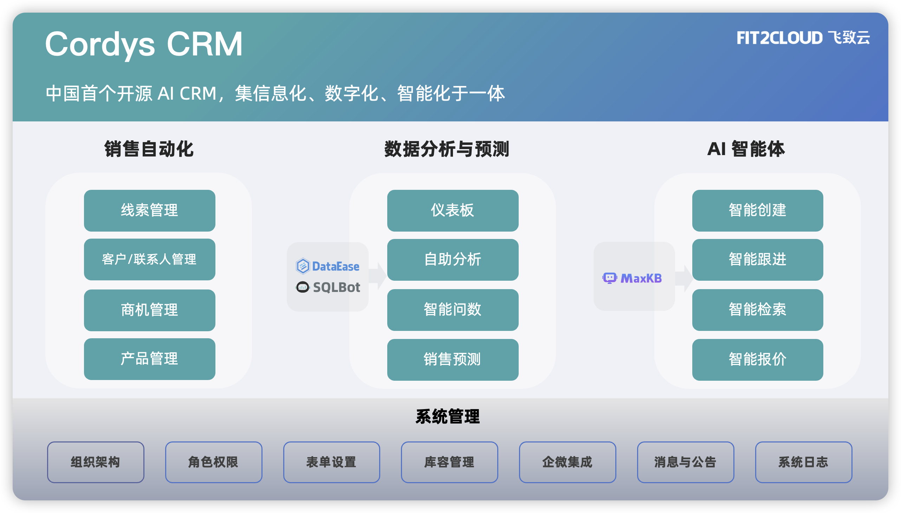

# 产品介绍

!!! Tip ""

    Cordys CRM 新一代的开源 AI CRM 系统，是集信息化、数字化、智能化于一体的「客户关系管理系统」，由飞致云匠心出品。
    
    Cordys（/ˈkɔːrdɪs/）由“Cord”（连接之绳）与“System”（系统）融合而成，寓意“关系的纽带系统”，诠释了 CRM 的本质：连接客户，缔造长期价值。

## 1 整体架构 

## 2 产品优势 

!!! Tip "" 

    - **灵活易用**      
      现代化的使用体验，灵活可配置的表单、流程和权限，轻松助力企业实现销售自动化；

    - **安全可控**    
      私有化部署，确保所有客户数据和业务信息都存储在企业自己的服务器上，企业对数据拥有完全的控制权；

    - **BI 加持**      
      借助 [DataEase](https://github.com/dataease/dataease) 强大的嵌入式能力和 [SQLBot](https://github.com/dataease/SQLBot) 的智能问数能力，轻松助力企业实现高效的数据分析和可视化；

    - **AI 加持**    
      开放 MCP Server，借助 [MaxKB](https://github.com/1Panel-dev/MaxKB) 强大的智能体开发能力，轻松助力企业实现各类销售智能体。

## 3 界面展示

<table style="border-collapse: collapse; border: 1px solid black;">
  <tr>
    <td style="padding: 5px;background-color:#fff;"></td>
    <td style="padding: 5px;background-color:#fff;"></td>
  </tr>
  <tr>
    <td style="padding: 5px;background-color:#fff;"></td>
    <td style="padding: 5px;background-color:#fff;"></td>
  </tr>
</table>

## 4 主要功能

!!! Tip ""

    - 线索管理：对“潜在客户”从初次接触到转换为正式客户的全流程追踪和管理，支持自定义线索表单，一键转换线索，帮助企业提升线索转化效率。
    - 客户管理：对已转化的“正式客户”的全生命周期管理，支持自定义客户表单、多成员协同跟进客户，以及对客户的联系人管理。
    - 商机管理：对“有明确购买意向的客户”从“需求确认”到“最终成交（或流失）”的全流程跟踪和管控，支持自定义商机表单、商机阶段管理。
    - 产品管理：对企业销售的产品/服务进行标准化管理，支持自定义产品表单以及产品管理功能。
    - 仪表板：支持嵌入第三方仪表板工具，如 DataEase、SQLBot 等主流 BI 平台，通过可视化方式展示关键业务数据和客户相关信息模块。
    - 智能体：支持嵌入企业级 AI 智能体平台 MaxKB，基于 CRM 数据创建高效智能体应用， 如智能创建（线索/客户/商机/联系人）、智能录入（跟进记录）、智能查重等。
    - 系统管理：包含组织架构、角色权限、模块设置、消息管理、企业设置以及系统日志功能。

## 5  了解更多

!!! Tip ""

    - [了解飞致云](https://www.fit2cloud.com/) 
    - [飞致云开源社区论坛](https://bbs.fit2cloud.com/)
