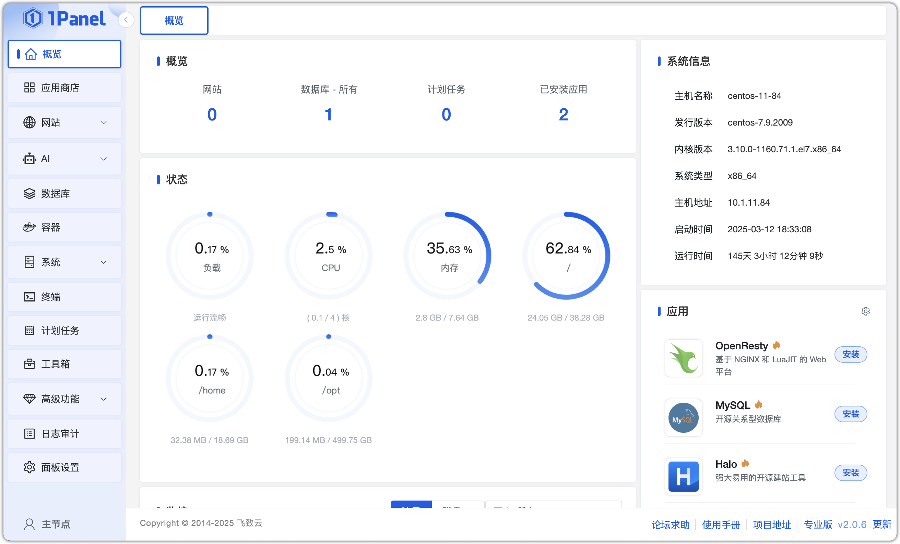
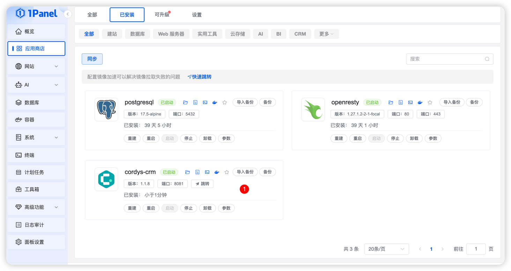

## 1 安装 1Panel

!!! Abstract ""

    关于 1Panel 的安装部署与基础功能介绍，请参考 [**1Panel 官方文档**](https://1panel.cn/docs/) 。完成 1Panel 的安装部署后，根据提示网址打开浏览器进入 1Panel，界面如下。    




## 2 安装 Cordys CRM

!!! Abstract ""


!!! Abstract ""
    在应用详情页选择最新的 Cordys CRM 版本进行安装，进行相关参数设置。

    * 名称：要创建的 Cordys CRM 应用的名称。
    * 管理员：admin 应用初始化创建的超级管理员用户名。
    * 管理员密码：CordysCRM 应用初始化创建的超级管理员密码（后续登录系统可以更改）。
    * 端口：Cordys CRM 应用的服务端口设置为 8081。
    * 端口外部访问：Cordys CRM 应用可以使用 IP:PORT 进行访问（Cordys CRM 应用必须打开外部端口访问）。

!!! Abstract ""
    点击开始安装后，页面自动跳转到已安装应用列表，等待安装的 Cordys CRM 应用状态变为已启动。


## 3 访问 Cordys CRM

!!! Abstract ""
    安装成功后即可通过浏览器访问地址 `http://目标服务器 IP 地址:8081`，并使用默认的管理员用户和密码登录 Cordys CRM。

    ```
    用户名: admin

    密码: CordysCRM
    ```


