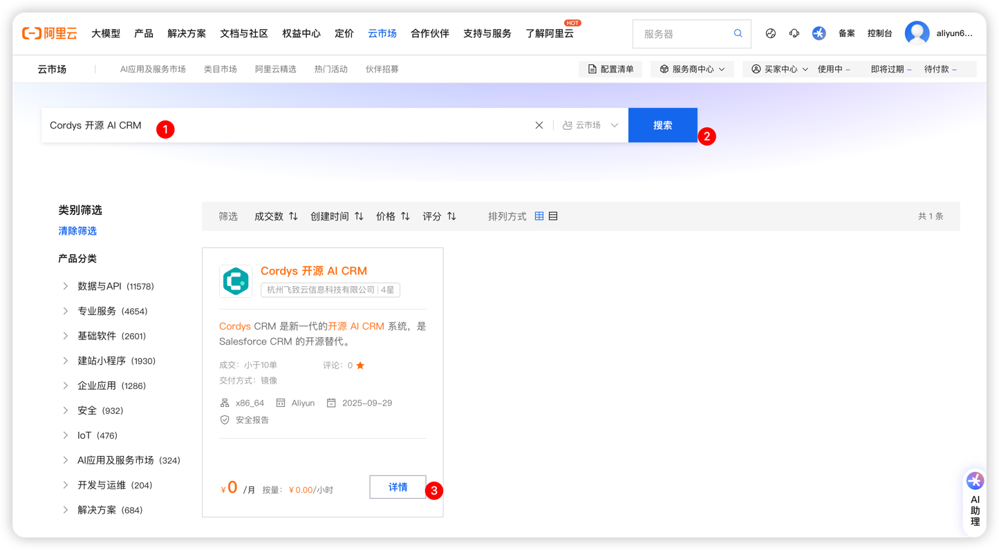
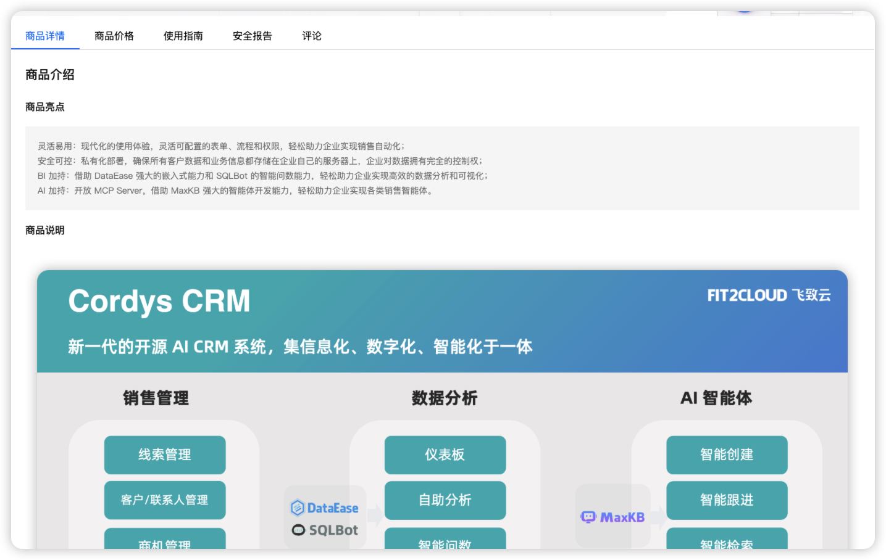
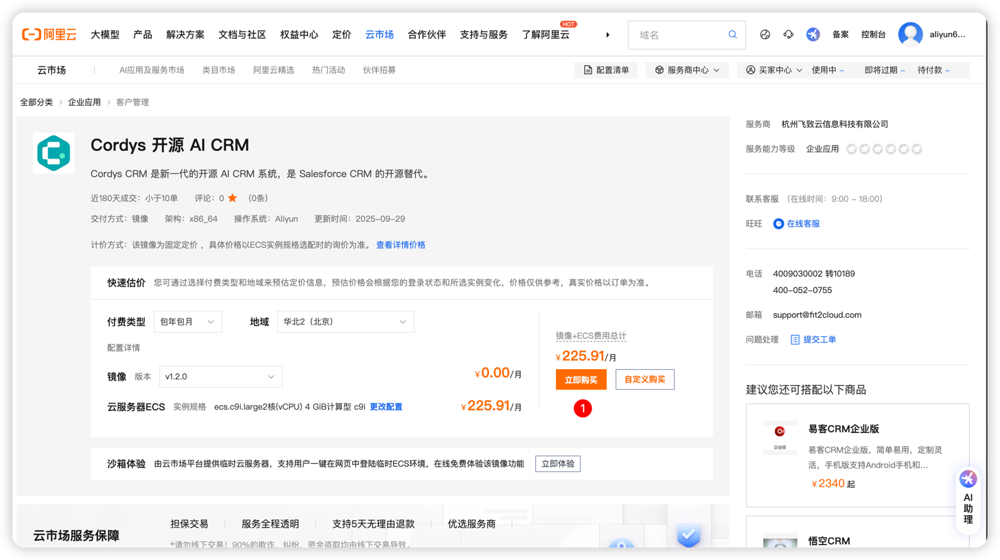
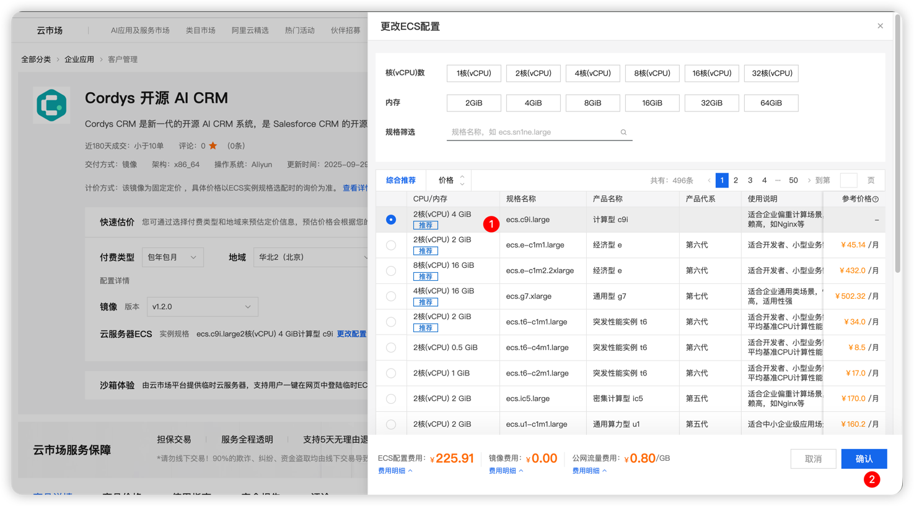
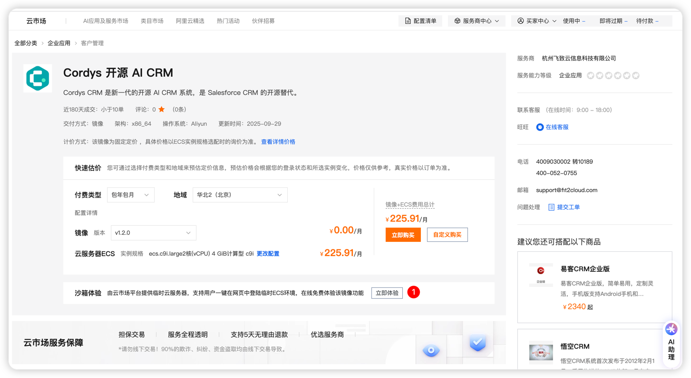
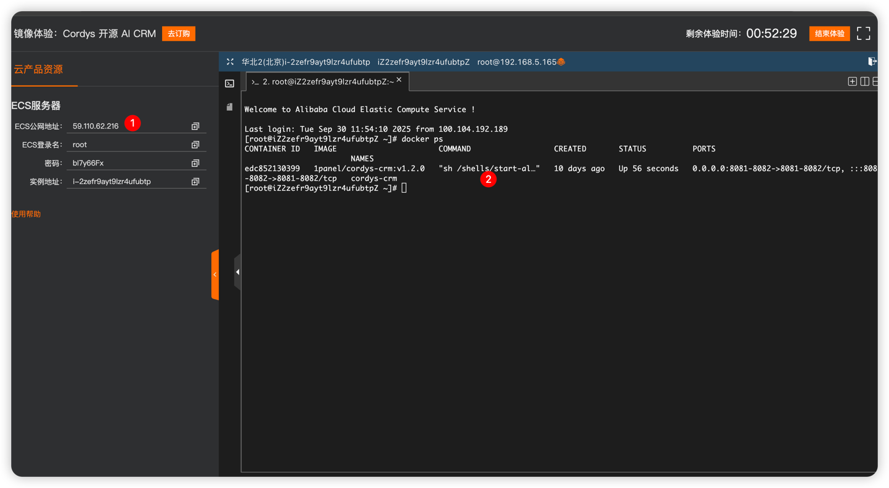

# 阿里云市场安装

## 1. 登录阿里云账号
!!! Abstract ""
    访问 [阿里云市场](https://market.aliyun.com/)，点击右上角的 **登录** 按钮，使用你的 **阿里云账号** 登录。

## 2. 搜索 Cordys CRM 应用
!!! Abstract ""

    - 在搜索栏输入 **Cordys CRM**，点击搜索图标。
    - 点击进入应用的 **详情页**。
    

## 3. 阅读应用说明

!!! Abstract ""
    在应用详情页，查看以下信息：  **商品详情** , **商品价格** , **使用指南** 等详细的介绍和注意事项。
    

## 4. 购买应用
!!! Abstract ""
    - 点击 **立即购买** 或 **自定义购买** 按钮。
    
    - 可根据自身情况选择 ECS 配置。  
    

## 5. 部署应用
!!! Abstract ""

    完成配置后，点击 **部署** 按钮，系统将自动为你部署应用。
        部署过程通常包括：
            配置服务器、数据库和存储。
            自动化安装应用所需的服务和组件。

!!! Abstract ""

    安装成功后即可通过浏览器访问地址 `http://目标服务器 IP 地址:8081`，并使用默认的管理员用户和密码登录 Cordys CRM。

    ```
    用户名：admin

    默认密码：CordysCRM
    ```


## 沙箱体验
!!! Abstract ""
    - 如果你只是想体验应用，可以选择 **沙箱体验** 选项，提供有限的使用时间。
    - 沙箱环境适合测试和评估应用的基本功能。
    
    - 等待部署完成。
    

!!! Abstract ""

    安装成功后即可通过浏览器访问地址 `http://ECS公网地址 IP 地址:8081`，并使用默认的管理员用户和密码登录 Cordys CRM。

    ```
    用户名：admin

    默认密码：CordysCRM
    ```
