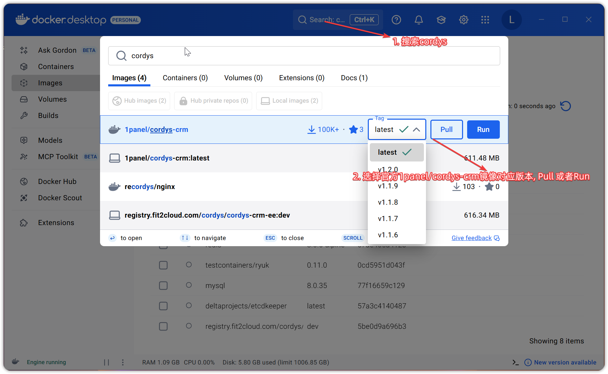
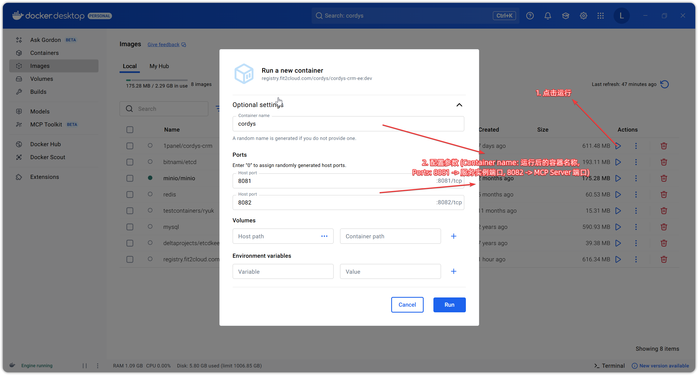
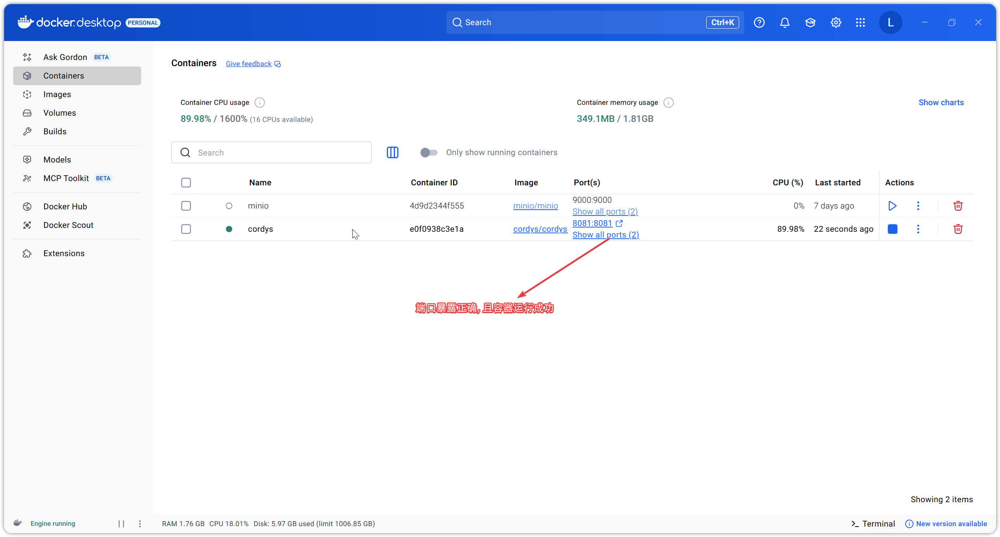
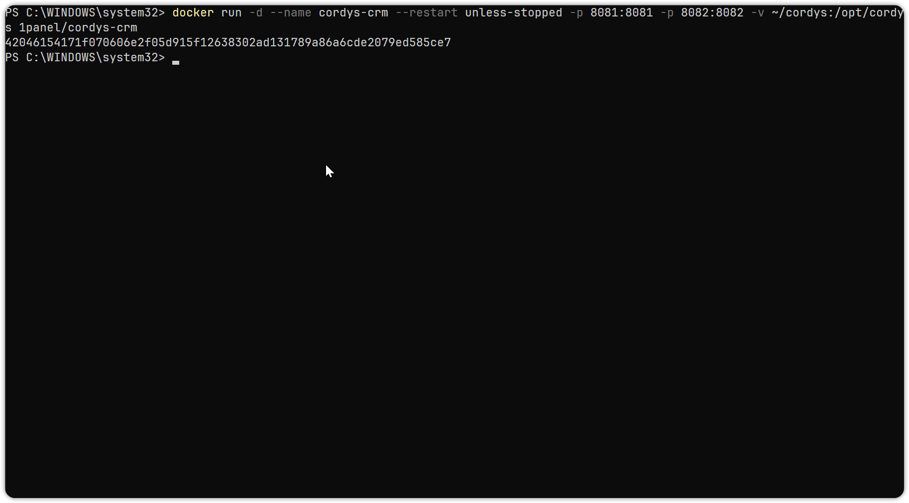
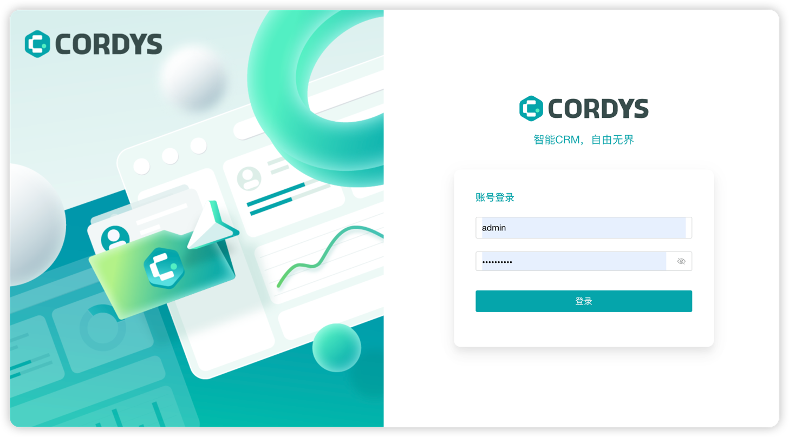

# windows 安装教程

## 1. 环境要求

 * 操作系统：win10/11 都可
 * 支持虚拟化技术, 至少4GB内存
 * 提前准备好wsl环境, 开启Hyper-v 以及下载docker desktop

## 2. 安装部署
### 2.1 图形化安装 (新手推荐)
1. 打开docker desktop, 在顶部搜索栏输入 `cordys` 关键字搜索, 然后下载镜像。

    

2. 下载完成后, 点击左侧的 `Images` 选项卡, 找到对应的 `1panel/cordys-crm` 镜像, 点击 `Run` 按钮, 填写相关参数, 然后点击 `Run` 即可启动容器。

    
3. 启动完成后, 点击左侧的 `Containers` 选项卡, 可以看到正在运行的 `cordys-crm` 容器。

    

> 注意: 端口号可以根据实际情况进行更改, 但要确保不冲突.

### 2.2 命令行安装 (适合有docker基础的用户)
1. 打开 `PowerShell` 或 `cmd` 窗口, 执行以下命令拉取镜像 (可选):
    ```bash
    docker pull 1panel/cordys-crm:latest
    ```
2. 拉取完成后, 执行以下命令启动容器:
    ```
    docker run -d --name cordys-crm --restart unless-stopped -p 8081:8081 -p 8082:8082 -v ~/cordys:/opt/cordys 1panel/cordys-crm
    ```
   
3. 容器启动成功示例
    
   
## 3. 登录访问

* 安装成功后即可通过浏览器访问地址 `http://IP 地址:8081` (本机可用 127.0.0.1)，并使用默认的管理员用户和密码登录 Cordys CRM。

    ```
    用户名：admin
    默认密码：CordysCRM
    ```


> 注意: 如果无法访问, 请检查端口防火墙设置, 确保`8081`端口已开放。