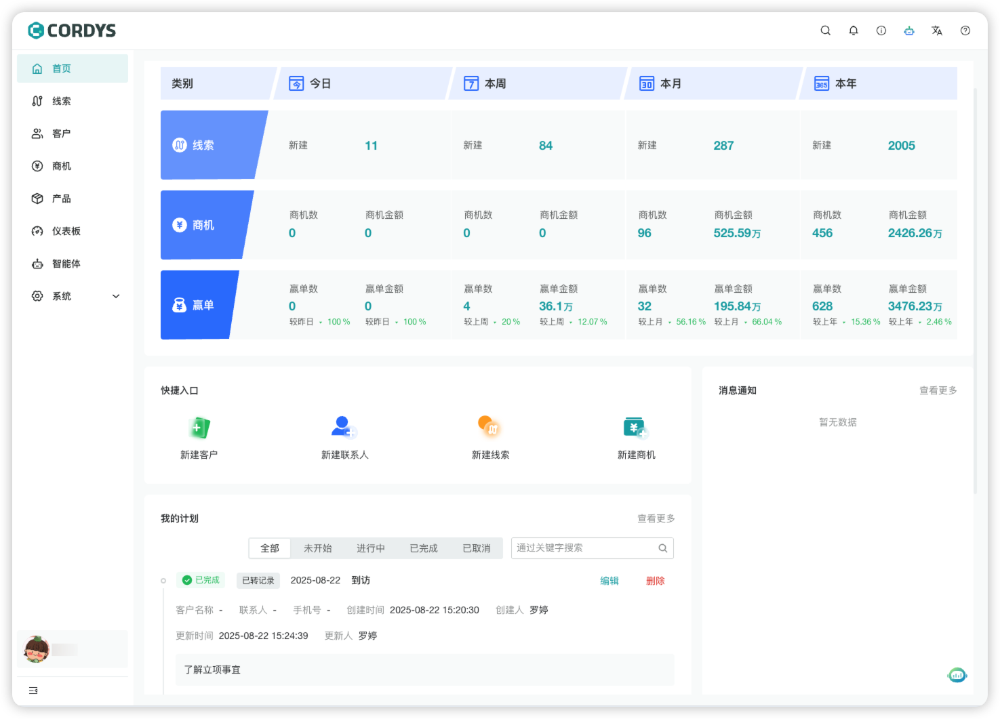
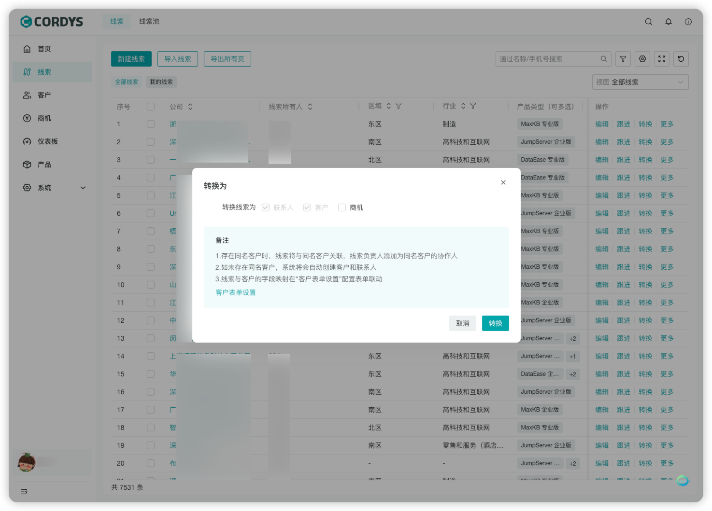
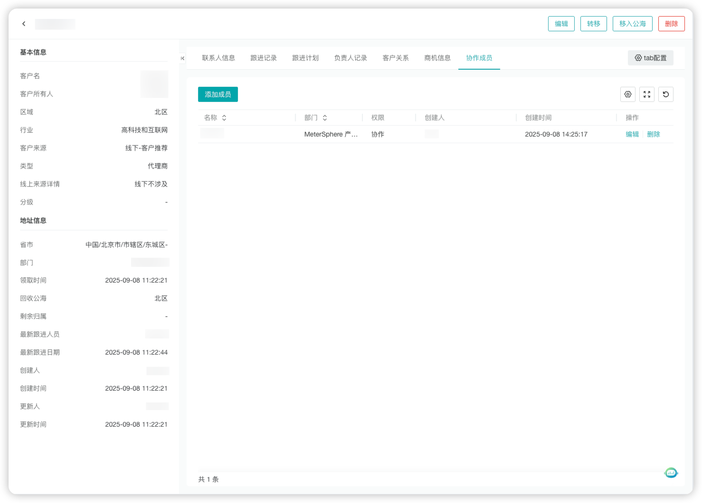
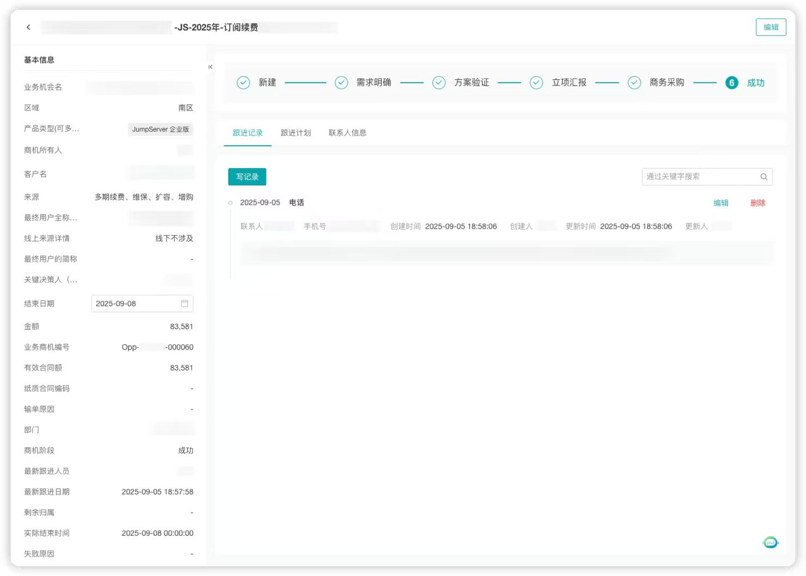
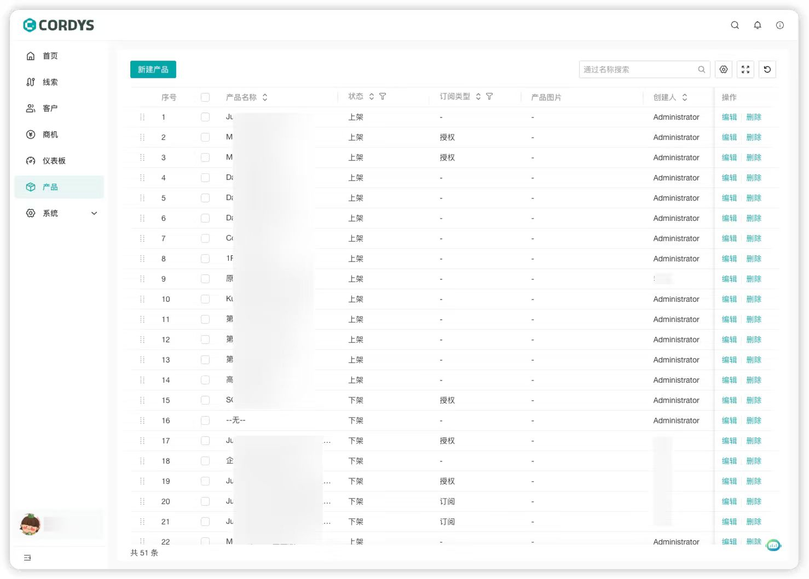
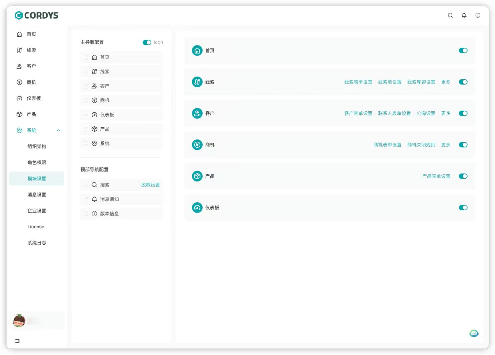
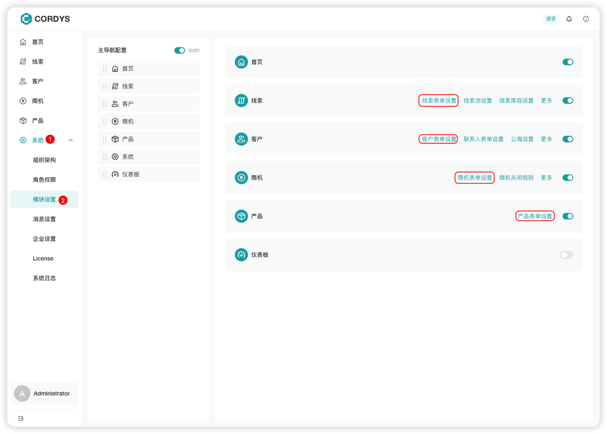

## 1 快速部署

!!! Tip ""
    可以通过 1Panel 应用商店快速安装 Cordys CRM：

    ```
    http://目标服务器 IP 地址:8081

    用户名：admin

    默认密码：CordysCRM
    ```
    
    详细步骤参考 [**1Panel 快速安装 Cordys CRM**](../installation/1panel_installtion/) 。

    如果是用于生产环境，推荐使用 [**离线包方式**](../installation/offline_installtion/) 进行部署。

## 2 界面介绍

!!! Tip ""
    Cordys CRM 主界面导航栏包含：【首页】、【线索】、【客户】、【商机】、【产品】和【系统】。

    左侧为功能导航区域支持功能模块的快速切换，当集成 BI 工具 DataEase 后，开启 【仪表板】导航页。





!!! Tip ""

    === "首页"

        支持数据概览和快速入口

        


    === "线索"

        对“潜在客户”从初次接触到转换为正式客户的全流程追踪和管理，支持自定义线索表单，一键转换线索，帮助企业提升线索转化效率。

        

    === "客户"

        对已转化的“正式客户”的全生命周期管理，支持自定义客户表单、多成员协同跟进客户，以及对客户的联系人管理。

         

    === "商机"

        对“有明确购买意向的客户”从“需求确认”到“最终成交（或流失）”的全流程跟踪和管控，支持自定义商机表单、商机阶段管理。

         

    === "产品"

        对企业销售的产品/服务进行标准化管理，支持自定义产品表单以及产品管理功能。

         

    === "系统"

        包含组织架构、角色权限、模块设置、消息管理、企业设置以及系统日志功能。

         

## 3 快速上手

!!! Abstract ""
    Cordys CRM 现代化的使用体验，灵活可配置的表单、流程和权限，轻松助力企业实现销售自动化。


### 3.1 表单配置

!!! Abstract ""
    以 admin 用户登录后，进入【系统管理】→【模块设置】 可以快速自定义业务相关的表单，实现销售自动化。



    


