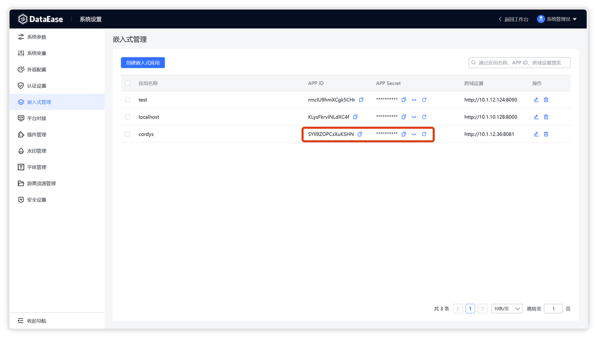
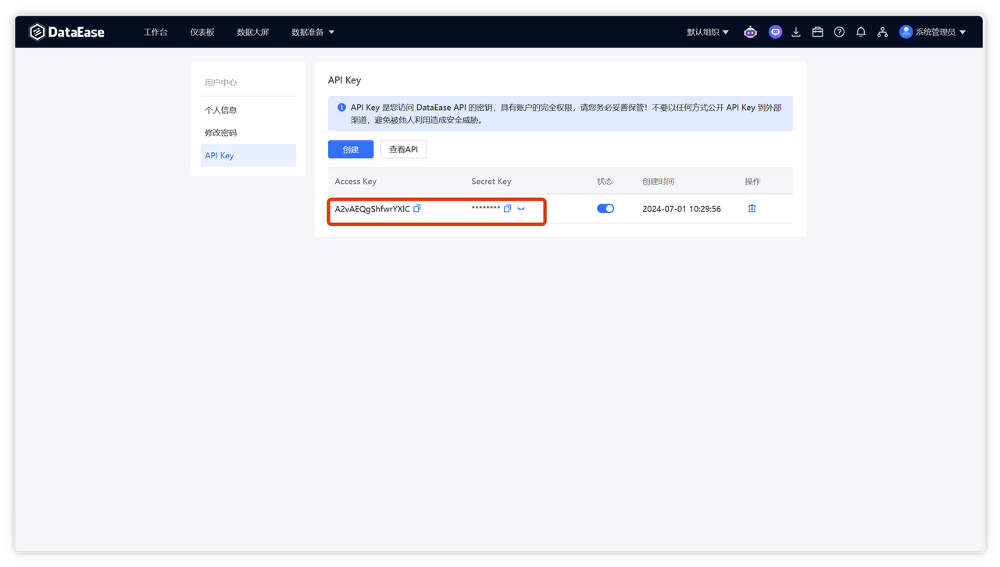
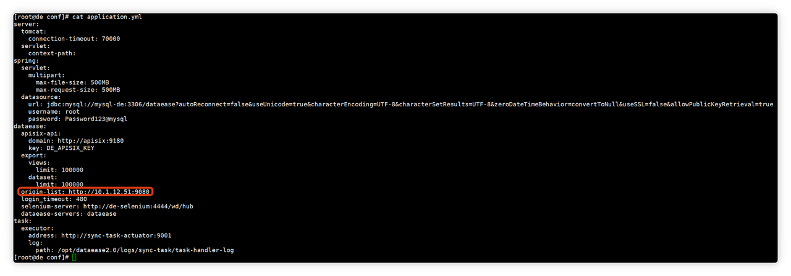
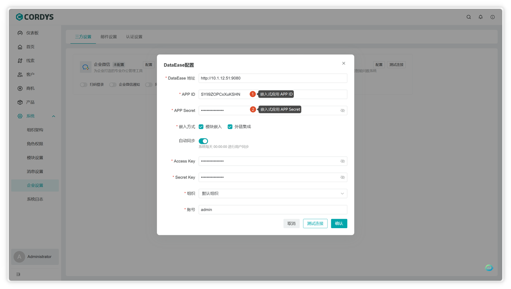
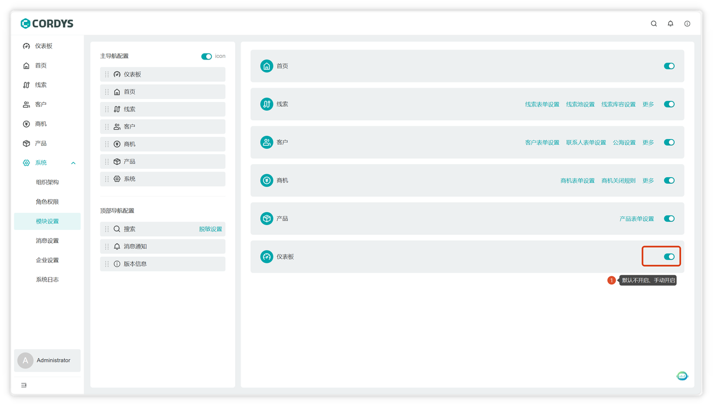
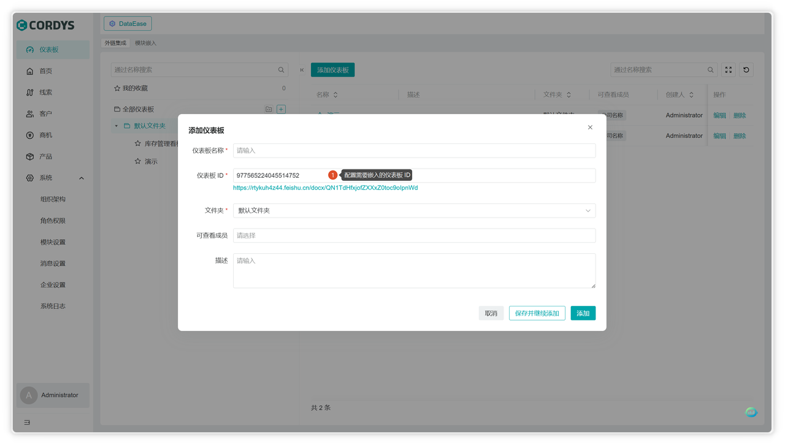
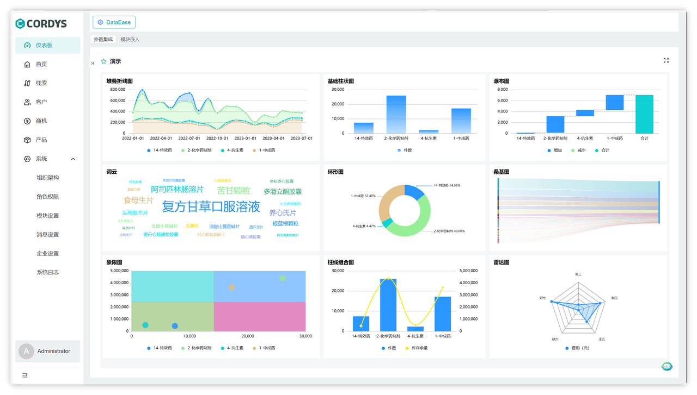
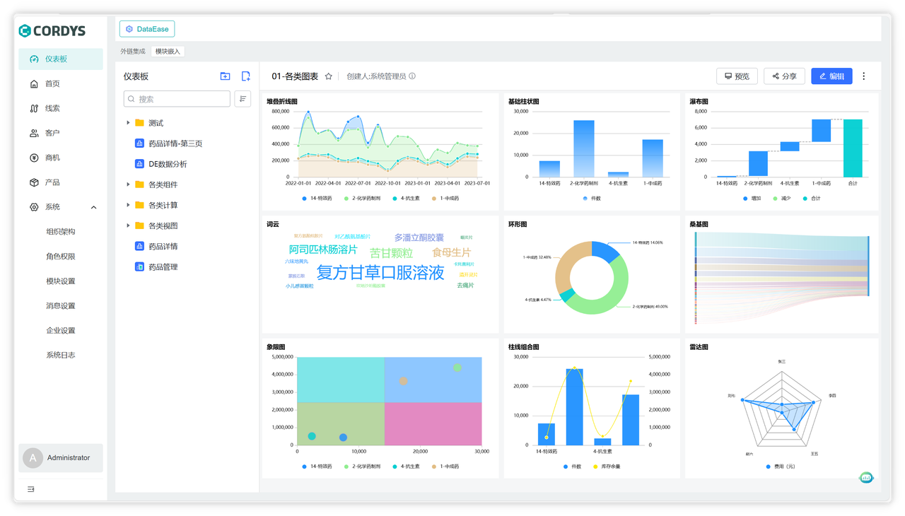

# 接入 DataEase 实现数据分析
!!! Abstract ""

     **注意**：需要用到 DataEase 的商业版本（嵌入式/专业版/企业版），请参考：[DataEase 版本说明](https://dataease.cn/versions.html)

## 获取 DataEase 对接信息

!!! Abstract ""
    在 DataEase 系统中获取必要的对接参数和配置信息。

    

    

## 配置 DataEase 跨域设置

!!! Abstract ""

    为确保 Cordys CRM 能够正常访问 DataEase，需要在 DataEase 中配置跨域设置。
    

## Cordys CRM 页面配置

!!! Abstract ""

    在 Cordys CRM 系统中配置 DataEase 集成设置：

    1. 登录 Cordys CRM 系统
    2. 进入【系统】>【企业设置】>【三方设置】
    3. 配置 DataEase 相关参数

    

---

## 开启仪表板菜单权限

配置完成后，需要为相关用户开启仪表板菜单的访问权限。

## DataEase 对接效果

### 外链集成
!!! Abstract ""

    通过外链方式集成 DataEase 仪表板，用户可以直接在 Cordys CRM 中查看数据分析结果。

    

    

### 模块嵌入
!!! Abstract ""

    将 DataEase 仪表板直接嵌入到 Cordys CRM 的相关模块中，实现无缝数据分析体验。

    