# 钉钉对接

## 钉钉配置

!!! Abstract ""

    #### 1. 钉钉管理员权限

    需要使用“钉钉管理员账号”（或具有通讯录管理权限的子管理员），普通成员账号无法创建应用或同步通讯录。

    #### 2. 登录 [钉钉管理后台](https://open-dev.dingtalk.com/) 并获取以下关键凭证：

    - 企业 ID（CorpID）

    

    #### 3. 创建应用并获取凭证

    在钉钉管理后台应用开发页面选择企业内部应用-钉钉应用-创建自建应用，在应用列表页面点击更多，查看应用详情-应用凭证与基础信息，并获取以下关键凭证：

     - 应用的 Client ID
     - 应用的 Client Secret

      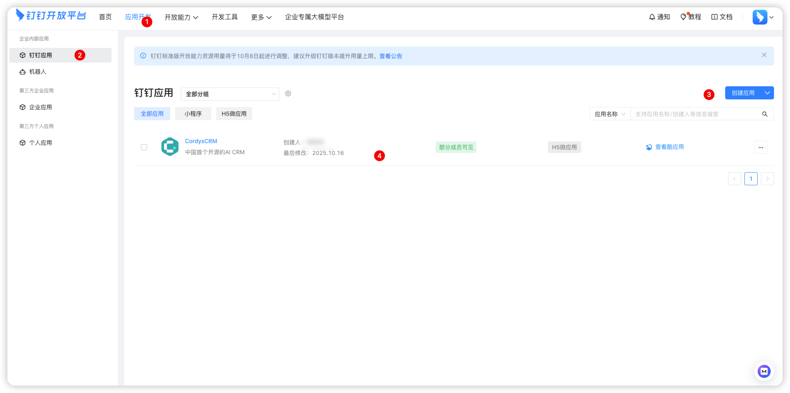
      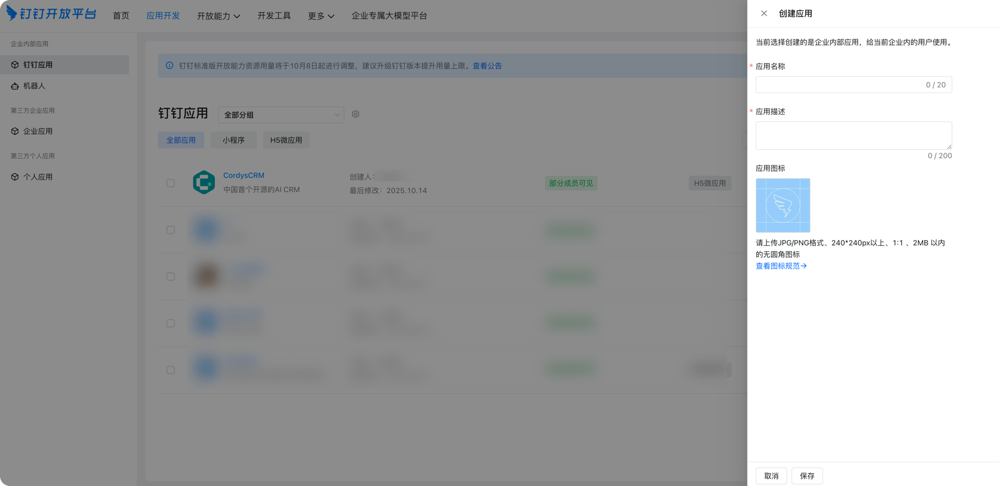
      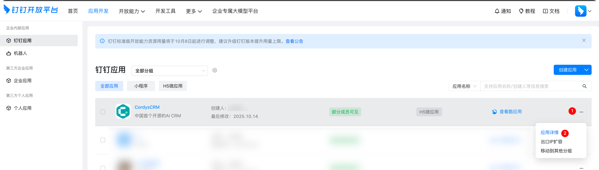
      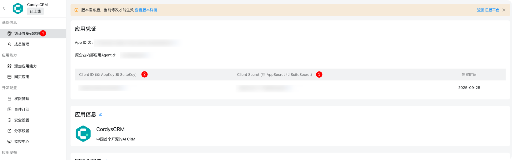

    #### 4. 配置通讯录 API 权限

      在权限管理页面为应用开启 API 权限。常见需要的权限包括：

      - 个人权限-个人手机号信息（同步组织结构）
      - 个人权限-通讯录个人信息读取权限（同步组织结构）
      - 通讯录管理-通讯录部门信息读取权限（同步组织结构）
      - 通讯录管理-成员信息读取权限（同步组织结构）

      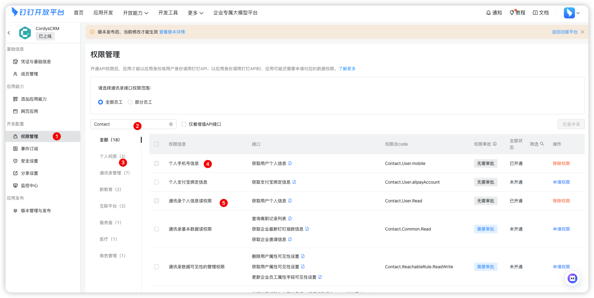

    
    #### 5. 安全配置

      - 安全设置-服务器IP出口配置应用的"可信 IP 白名单"，确保调用 API 时不被拒绝, 配置回调 URL
      - 分享设置-配置回调 URL(用户免登录)

      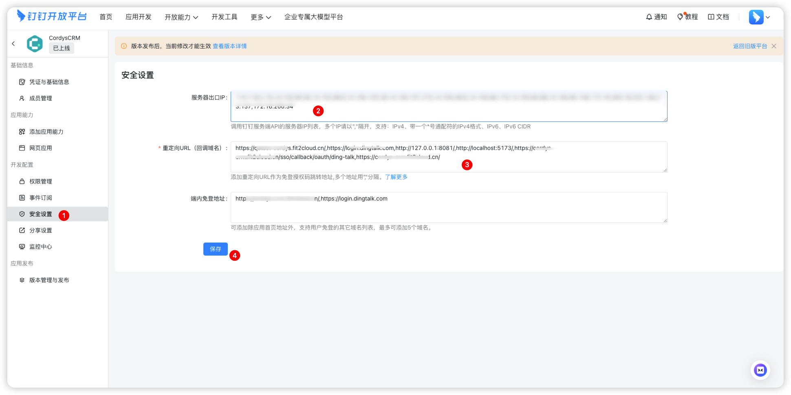
      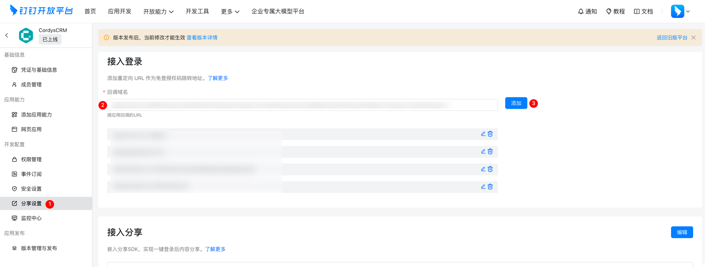

    #### 6. 应用能力

      - 添加应用能力-添加网页应用 此功能可选，如果需要在钉钉工作台访问 Cordys CRM 则必须添加此功能
      - 配置网页应用 
        pc端访问地址 https://yourdomain 或 https://login.dingtalk.com/oauth2/auth?redirect_uri=https%3A%2F%2Fwww.aaaaa.com%2Fa%2Fb&response_type=code&client_id=dingxxxxxxx&scope=openid&state=dddd&prompt=consent
        移动端访问地址 https://yourdomain 或 https://login.dingtalk.com/oauth2/auth?redirect_uri=https%3A%2F%2Fwww.aaaaa.com%2Fa%2Fbmobile&response_type=code&client_id=dingxxxxxxx&scope=openid&state=dddd&prompt=consent
      - 配置分享设置-配置回调  https://yourdomain 或 https://login.dingtalk.com
      
      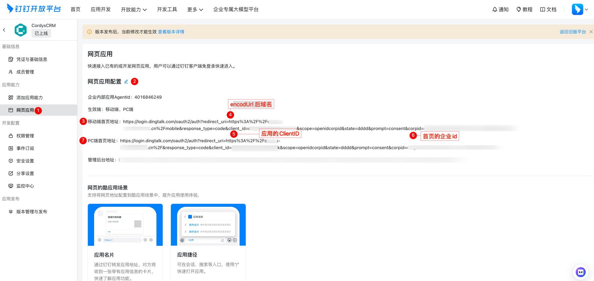

    #### 7. 数据准备

      确认外部系统中的部门、成员数据字段与钉钉字段对应：

      - 部门 ID、父部门 ID、部门名称
      - 成员账号（userid）、姓名、职位

## Cordys CRM 配置同步组织架构

### 配置钉钉信息

!!! Abstract ""

    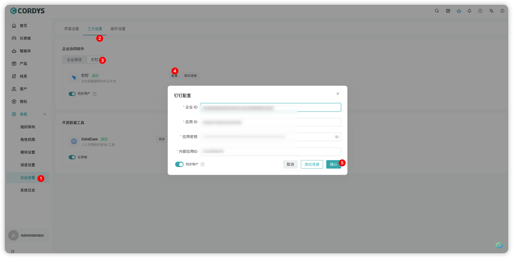

### 同步钉钉组织架构

!!! Abstract ""

    1. 点击【系统】菜单，进入【组织架构】页面
    2. 点击「更多」按钮下的「钉钉同步」选项，系统将自动触发同步流程
    3. 同步完成后，页面左侧的组织架构区域将自动展示从钉钉同步过来的完整组织架构

    **后续维护说明**：当钉钉中新增成员或调整组织架构后，只需重复执行上述「钉钉同步」操作，即可完成最新组织架构的更新。

    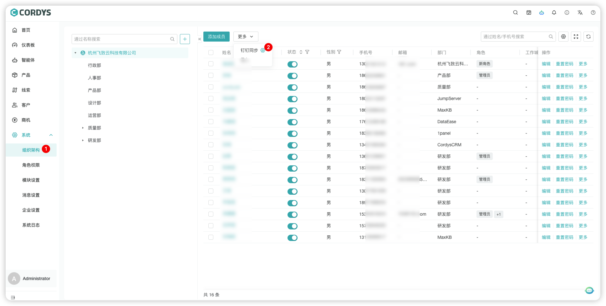

    #### 重要提醒：

       - 所有钉钉配置均需要应用发布成功后生效
         
      👉 官方文档：[通讯录同步](https://open.dingtalk.com/document/orgapp/contacts-overview)

## 钉钉工作台访问 Cordys CRM

!!! Abstract ""

    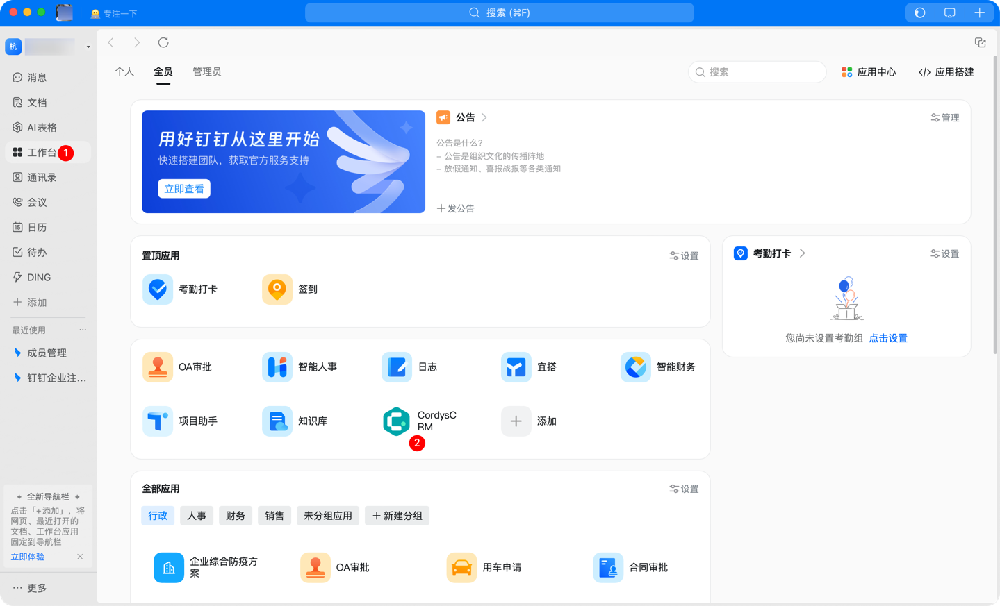
    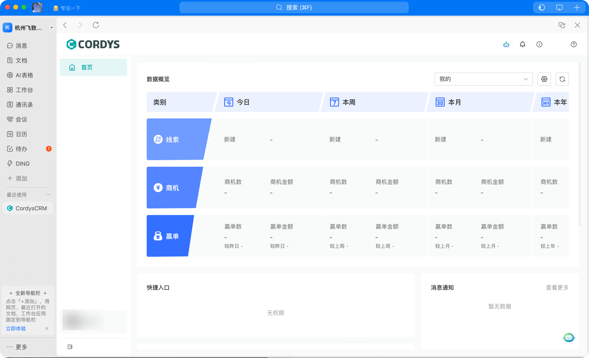
