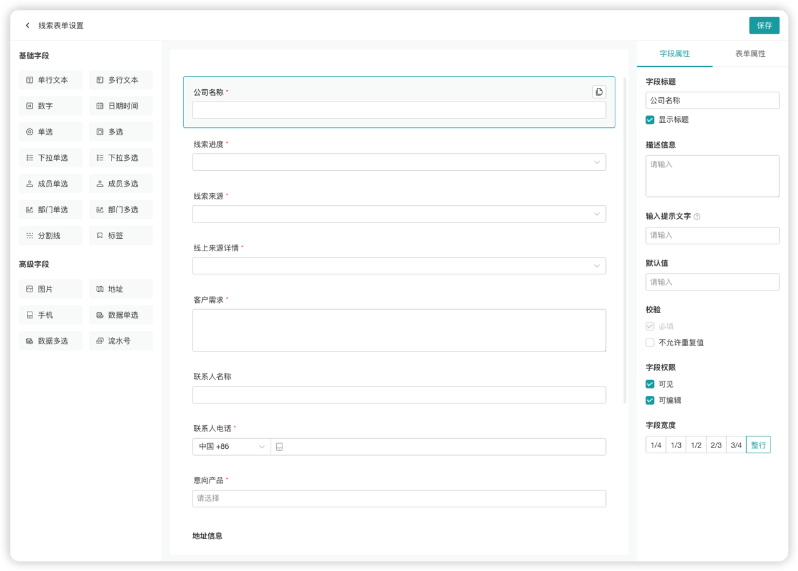
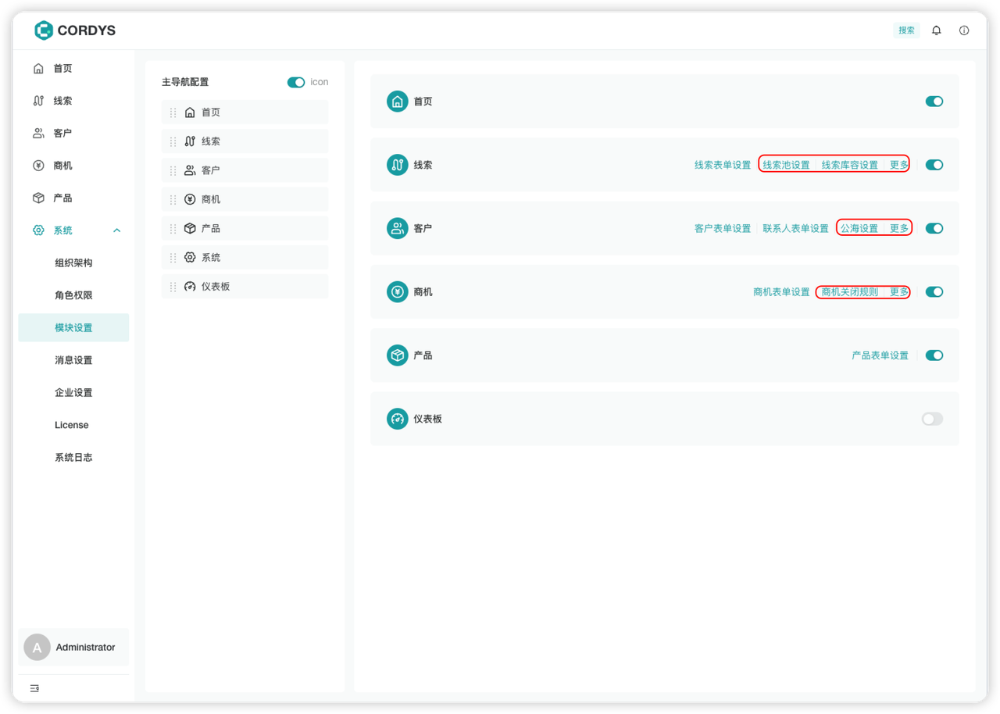
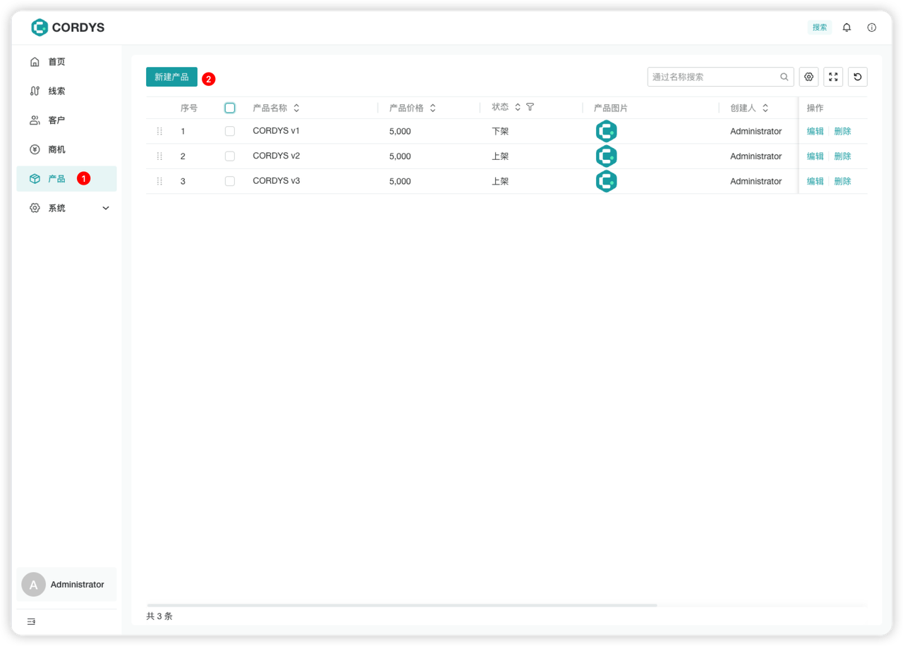

# 配置业务表单

点击左侧菜单【系统】，进入【模块设置】页面。

系统已内置以下业务表单模板：
- **线索表单**
- **客户表单**
- **商机表单**
- **产品表单**

用户可以根据公司业务需求自定义表单内容。

---

## 表单设置

点击相应业务的「表单设置」按钮，进入自定义表单设置页面。

### 操作步骤

1. **添加字段**：从左侧选择字段组件，拖拽至中间表单区域
2. **配置属性**：在右侧字段属性面板修改字段的基本信息、约束、权限等
3. **调整布局**：在表单属性中修改整体表单布局

---

## 业务规则设置

在【模块设置】中，可以对不同模块的业务规则进行自定义配置。

### 可配置的业务规则

- **线索池规则**
- **公海规则**
- **库容规则**

