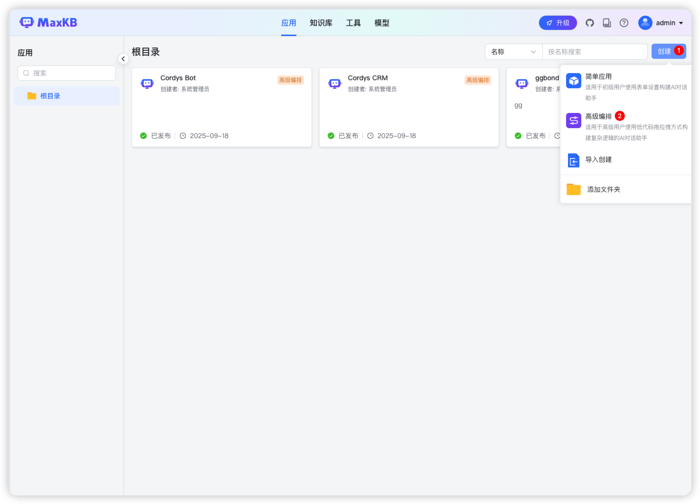
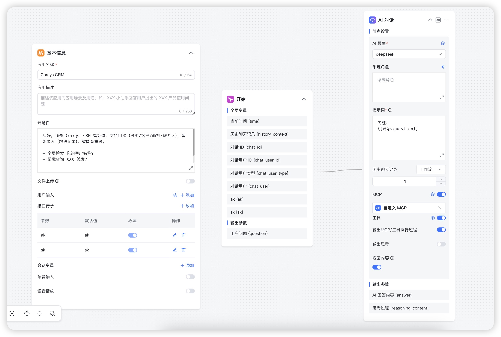
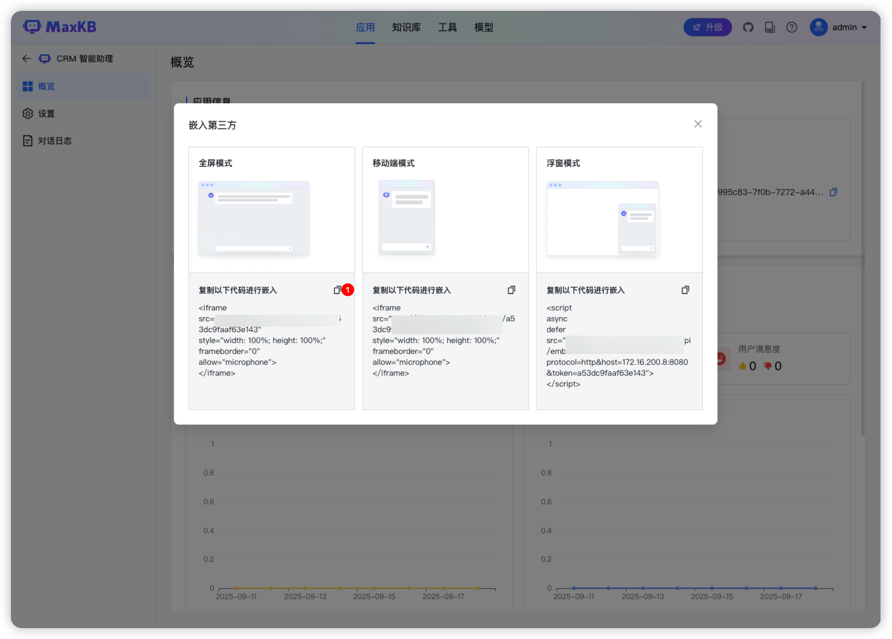
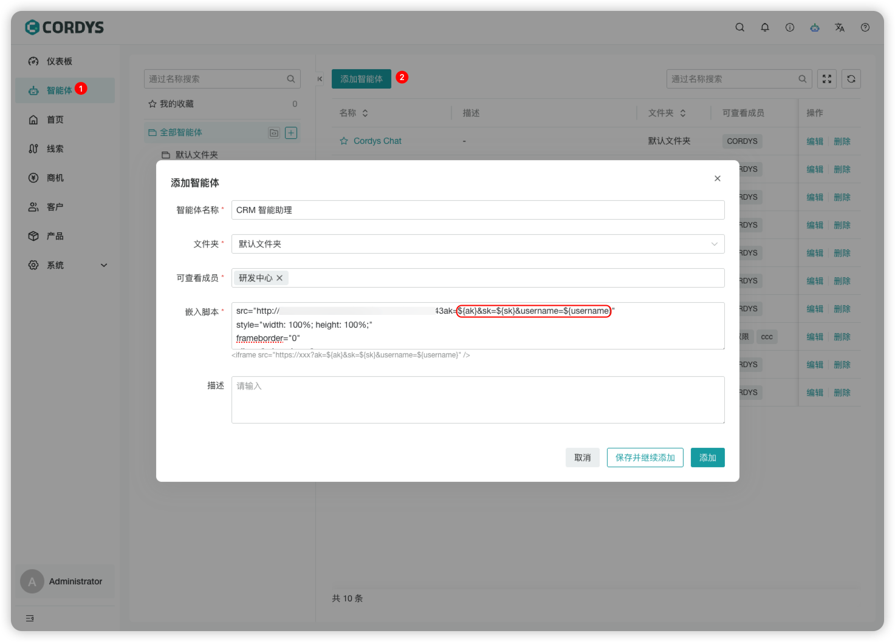
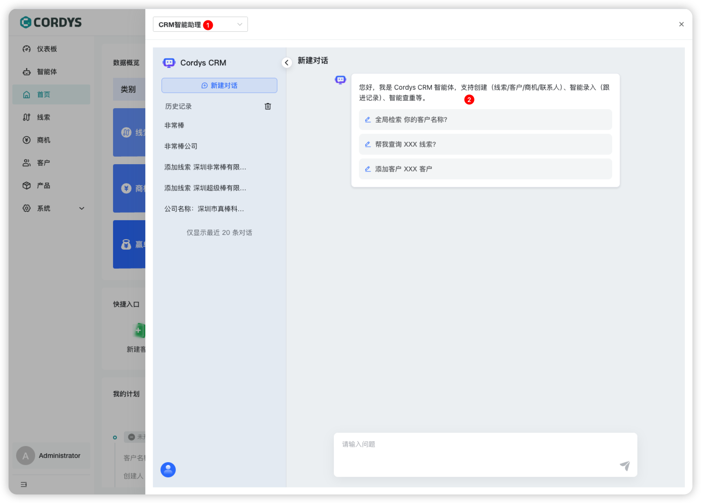
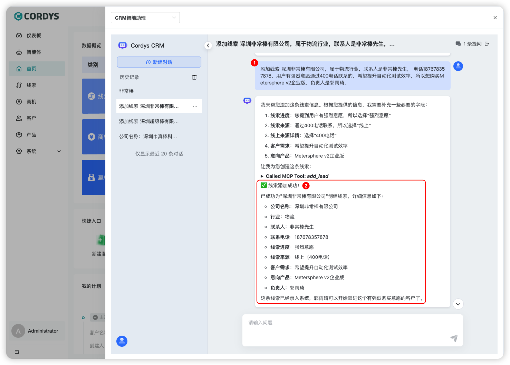
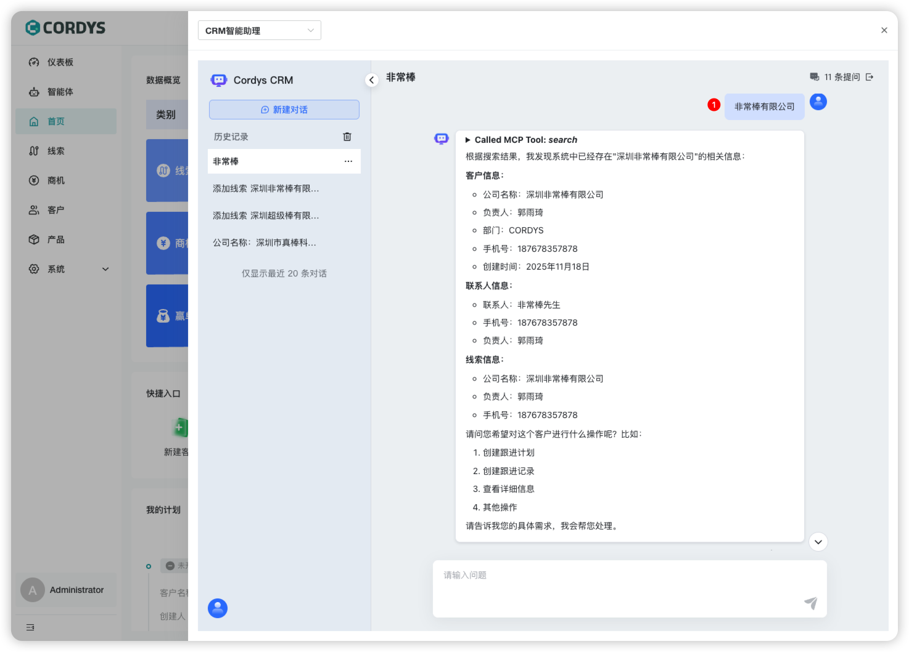
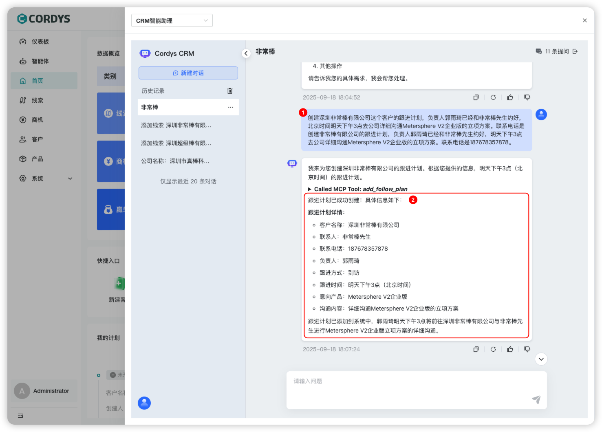

# 接入 MaxKB 实现销售智能体

## 添加 MaxKB 应用

### 创建应用

1. 登录 MaxKB
2. 点击「创建」选择「高级编排」



3.进入应用工作流编排页面



4.选择创建好的应用点击「嵌入第三方」，选择模式并复制代码



## 配置 MaxKB 应用

### 在 Cordys CRM 中配置

1. 登录 Cordys CRM 系统
2. 进入【智能体】模块
3. 点击「添加智能体」
4. 录入基本信息并粘贴上述脚本

> **注意**  
> Cordys CRM 支持获取以下变量传递到 MaxKB 应用中
>
> | 参数名    | 说明           | 示例                  |
> |-----------|----------------|-----------------------|
> | `ak`      | Access Key     | `ak=yourAk`           |
> | `sk`      | Secret Key     | `sk=yourSk`           |
> | `username`| 用户名         | `username=admin`      |
>
> 示例：
> ```
> 在嵌入脚本的 src 中追加 ak=${ak}&sk=${sk}&asker=${username}
> ```



### 验证配置

配置完成后：

1. 点击右上角机器人icon进入智能体对话窗口
2. 对话窗口左上角成功展示已添加的智能体
3. 对话窗口展示编排的欢迎语即表示配置成功



## 使用销售智能体

### 智能创建线索

1.将线索基本信息描述完整发送给智能体

2.智能体根据用户的描述信息快捷创建线索

> **注意**：用户术语识别以及字段匹配均可在MaxKB工作流编排中进行调整。



### 智能查询

1.输入客户名称关键字发送给智能体

2.智能体根据关键字全局搜索并返回查询结果



### 智能跟进

1.将跟进计划基本信息描述完整发送给智能体

2.智能体根据用户的描述信息快捷创建指定客户的跟进计划



更多智能体，正在开发中.....

