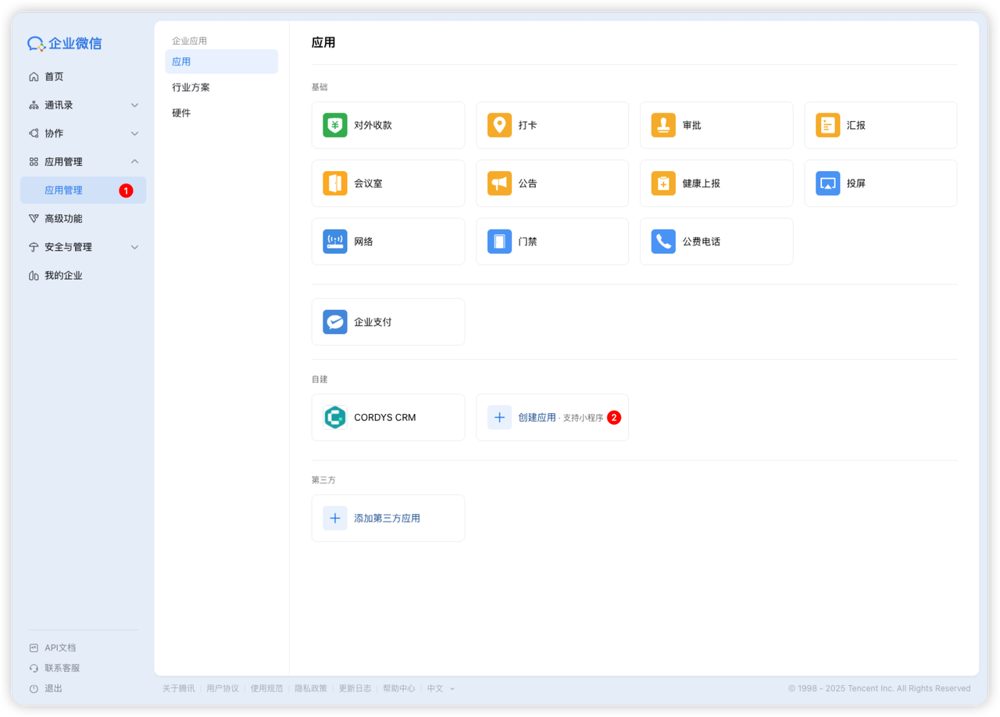
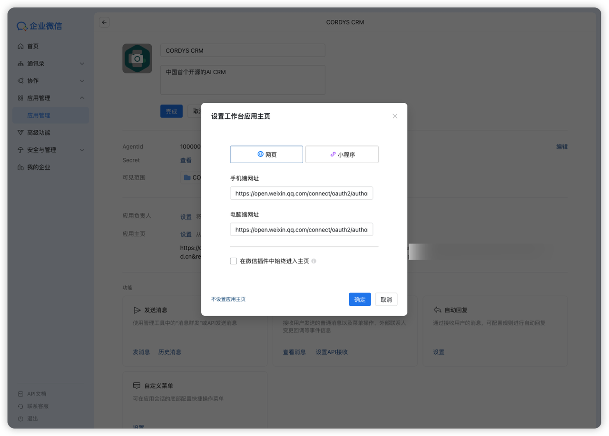
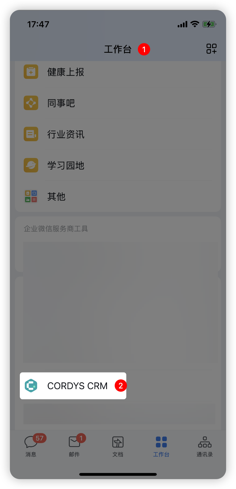
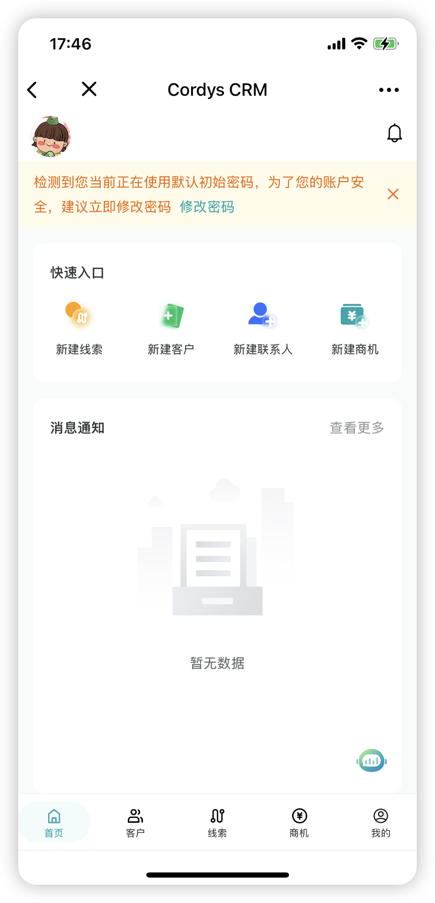
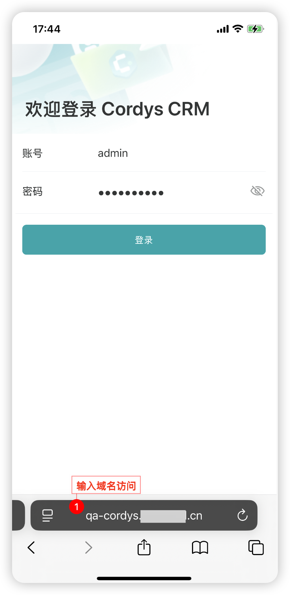

# 移动端访问

## 从企业微信工作台进入小程序

### 配置前的准备工作

在进行工作台配置前，需要满足以下条件：
- **企业管理员权限**：只有管理员或有相应权限的成员可以配置工作台
- **已注册企业微信账号**：确保企业已开通企业微信

### 进入企业微信管理后台

可通过以下方式进入：
- **PC端**：访问 https://work.weixin.qq.com/wework_admin/frame
- **手机端**：进入"企业微信-工作台管理"模块

### 创建应用

1. 企业管理员账号登录后，在左侧菜单选择【应用管理】>【工作台】或【工作台管理】
2. 点击「创建应用」

3. 选择「添加自建应用」

### 配置应用信息

填写以下应用信息：

#### 基本信息
- **名称**：应用在工作台显示的名称
- **图标**：建议尺寸 120x120px
- **描述**：简要说明应用功能

#### 跳转方式
- **网页应用**：填写 Cordys CRM 部署地址

#### 可见范围设置
可选择以下范围：
- 全体成员可见
- 指定部门/角色/成员可见

> **注意**：对指定可见范围的成员，系统将自动在工作台显示应用。

详情可参照 [企业微信开发者中心文档](https://developer.work.weixin.qq.com/)

### 微信工作台访问

后台配置完成后：
1. 打开手机企业微信
2. 进入【工作台】
3. 找到配置的小程序并点击进入

| 工作台访问 | 移动端界面 |
| :---: | :---: |
|  |  |

---

### 手机浏览器访问

在手机端浏览器地址栏输入 Cordys CRM 部署地址，即可完成系统访问。

| 手机浏览器访问 | 移动端界面 |
| :---: | :---: |
|  |  |
