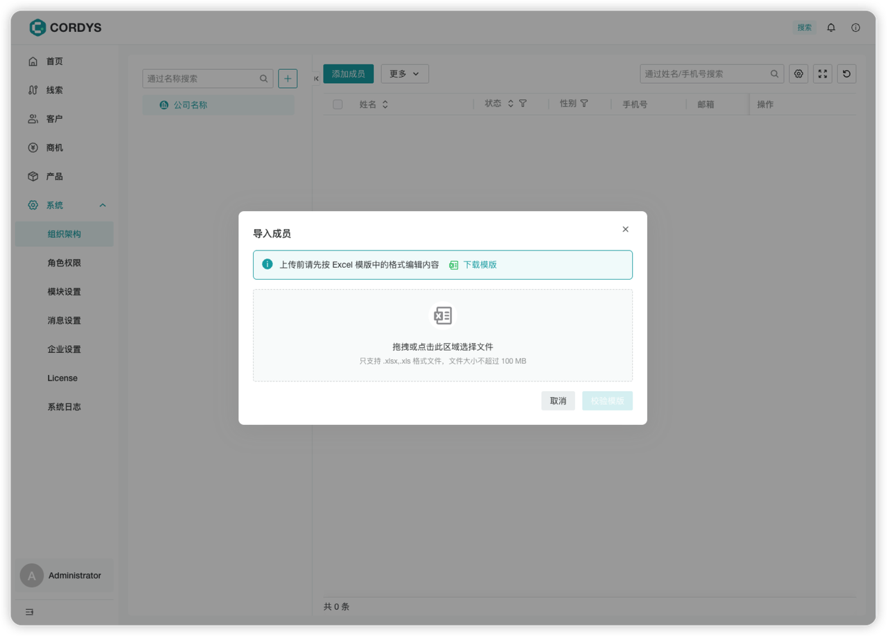
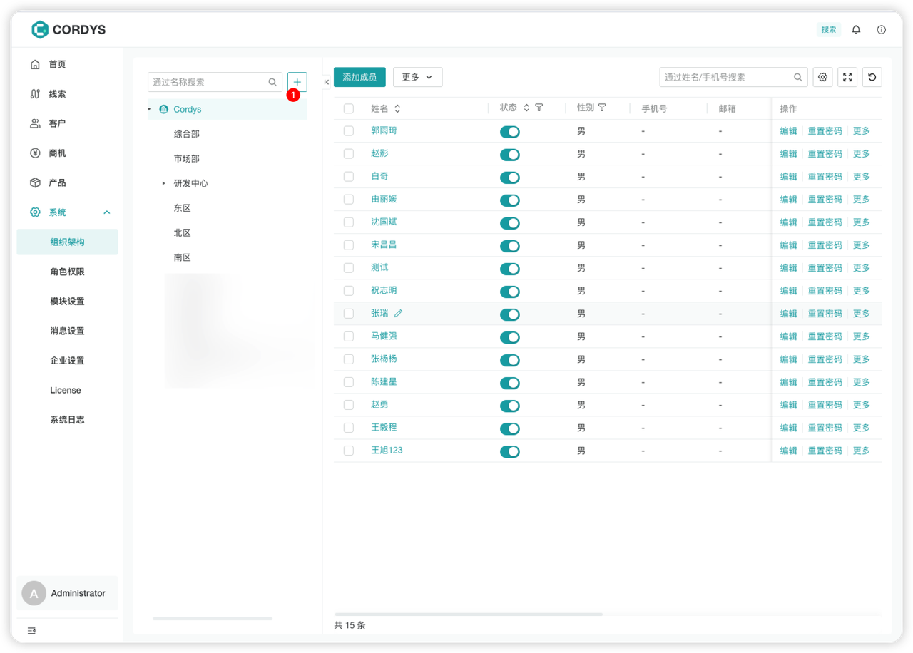
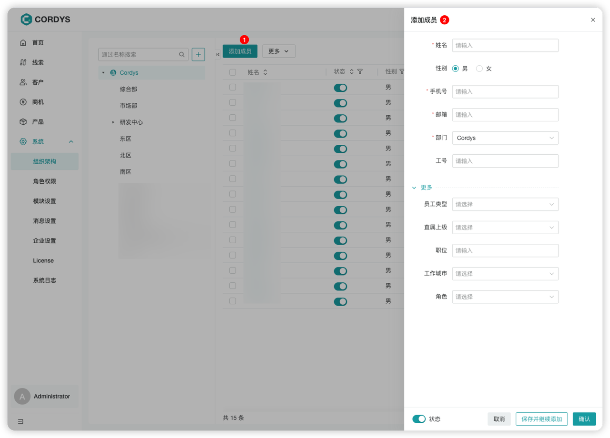
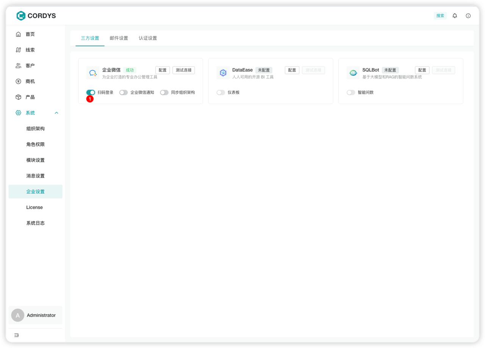

# 组织架构管理

## 快捷导入成员

!!! Abstract ""

    **注意**：导入成员功能与企业微信同步功能互斥，请确认同步组织架构开关处于关闭状态。

### 操作步骤

!!! Abstract ""

    1. 点击「更多」按钮下的「导入」选项
    2. 在导入成员弹窗中，下载模板
    3. 根据模板要求维护好成员信息
    4. 上传模板文件，即可完成导入

    

## 手动添加成员

!!! Abstract ""

    **注意**：添加成员功能与企业微信同步功能互斥，请确认同步组织架构开关处于关闭状态。

### 添加部门信息

!!! Abstract ""

    

### 添加成员

!!! Abstract ""

    录入成员基本信息，即创建成功。

    

## 成员登录系统

### 账号登录

!!! Abstract ""

    所有系统成员均可使用账号 & 密码登录系统：
    
    - **账号**：手机号或邮箱
    - **密码**：手机号后6位

    

### 扫码登录

!!! Abstract ""

    从企业微信同步的成员，在【企业设置】→【三方设置】中开启扫码登录后，即可使用扫码登录功能。

    