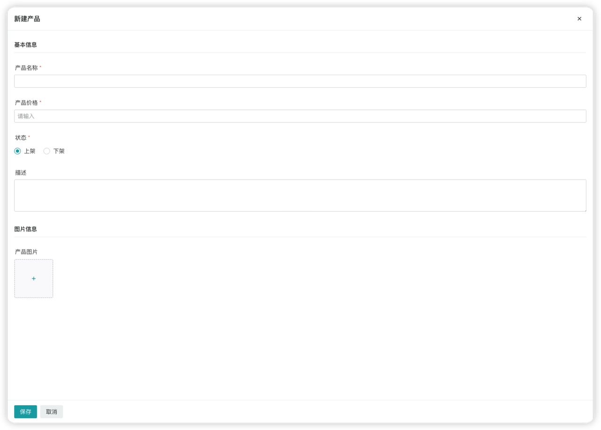
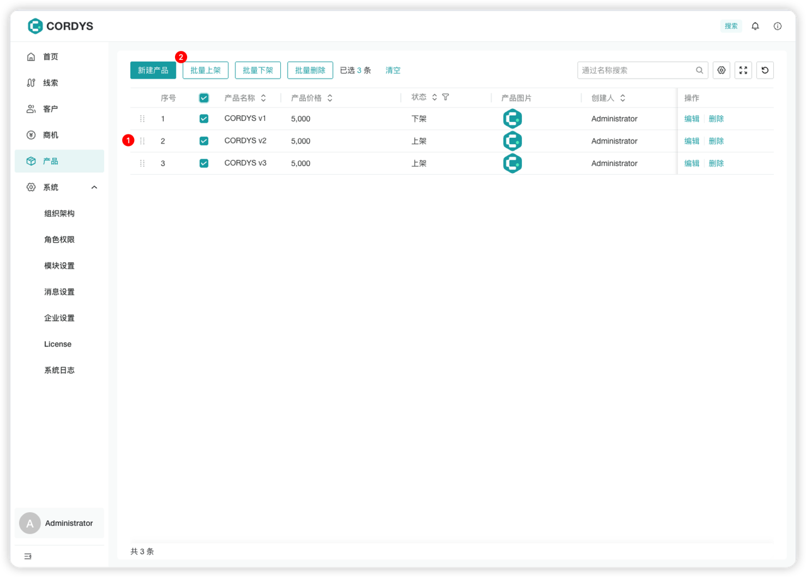

# 产品信息录入
!!! Abstract ""

    在左侧菜单点击【产品】，进入产品管理页面。

## 添加产品

!!! Abstract ""
    
    用户可以将产品的基础属性（如名称、价格、图片等）录入并保存即可创建成功。

     **提示**：产品表单可以根据公司产品特性在表单设置中进行自定义。

    

    

## 管理产品

!!! Abstract ""

    产品列表支持以下功能：

    - 调整产品排序
    - 批量产品操作

    