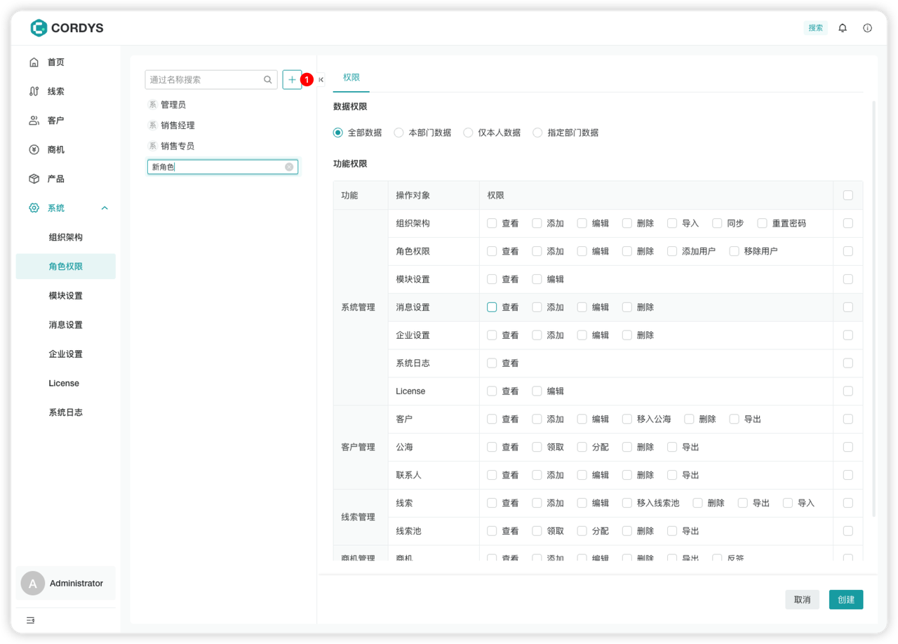
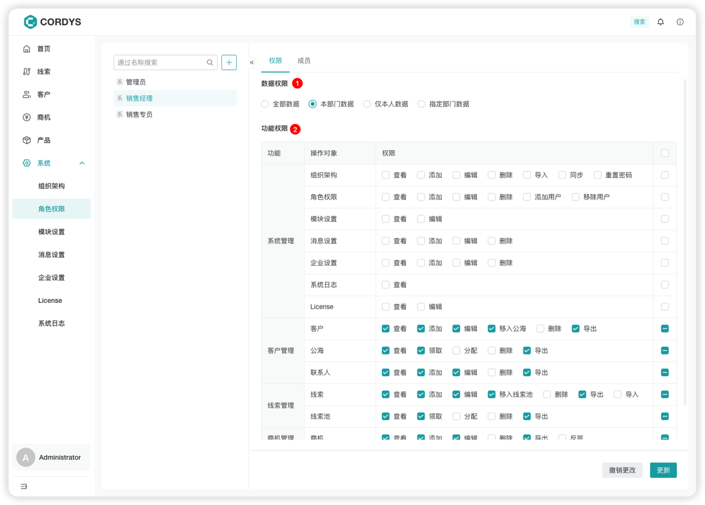
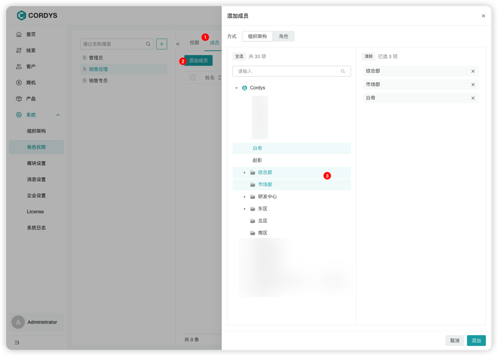

# 配置角色与权限

!!! Abstract ""

     点击【系统】菜单，进入【角色权限】页面。

## 添加角色
!!! Abstract ""

    系统已内置三种角色： **管理员** ， **销售经理** ，**销售专员**

    点击「添加」按钮即可触发添加新角色功能。

    

## 从两个维度配置角色权限
### 功能权限
!!! Abstract ""
    通过导航栏的功能模块、页面功能按钮进行控制。

### 数据权限
!!! Abstract ""
    通过组织架构控制数据查询范围。

    

## 添加角色成员

### 操作步骤

!!! Abstract ""

    1. 选择需要配置的角色
    2. 切换到「成员列表」标签页
    3. 点击「添加成员」按钮
    4. 可选择以下方式添加成员：

        - 按部门添加
        - 按个人添加
        - 从其他角色批量添加成员

    