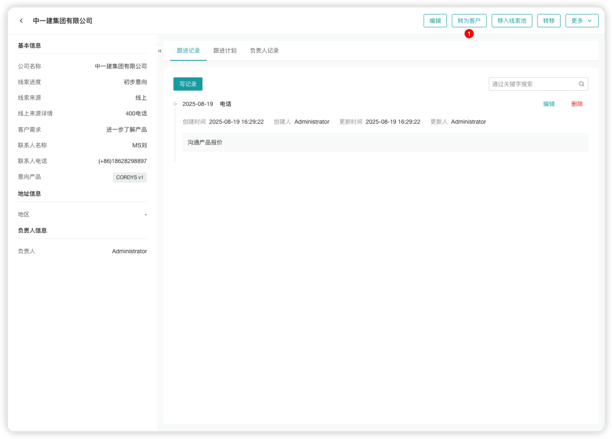

# 日常销售管理

## 新建线索

在左侧菜单点击【线索】，进入线索管理页面。

用户可以「新建线索」或快捷「导入线索」。

> **提示**：线索表单可以根据公司业务特性在表单设置中进行自定义。

---

## 线索转换

选择线索，点击「转换」，可以快捷将线索转换成客户/商机。

---

## 新建客户

在左侧菜单点击【客户】，进入客户管理页面。

用户可以：
- 「新建客户」
- 快捷「线索转为客户」

> **提示**：客户表单可以根据公司业务特性在表单设置中进行自定义。

### 线索转为客户

在线索详情中，点击「转为客户」，即可将线索一键转为客户。

> **注意**：转客户的线索不会展示在线索列表中。

---

## 新建商机

在左侧菜单点击【商机】，进入商机管理页面。

用户可以：
- 「新建商机」
- 快捷「线索转为商机」

---

## 跟进商机

点击商机名称或「跟进」按钮，进入商机详情页面。

### 功能说明

用户可以根据跟进情况进行以下操作：
- 修改商机阶段
- 录入当前商机的「跟进记录」
- 添加「跟进计划」

