# 日常销售管理

## 新建线索
!!! Abstract ""

    在左侧菜单点击【线索】，进入线索管理页面。

    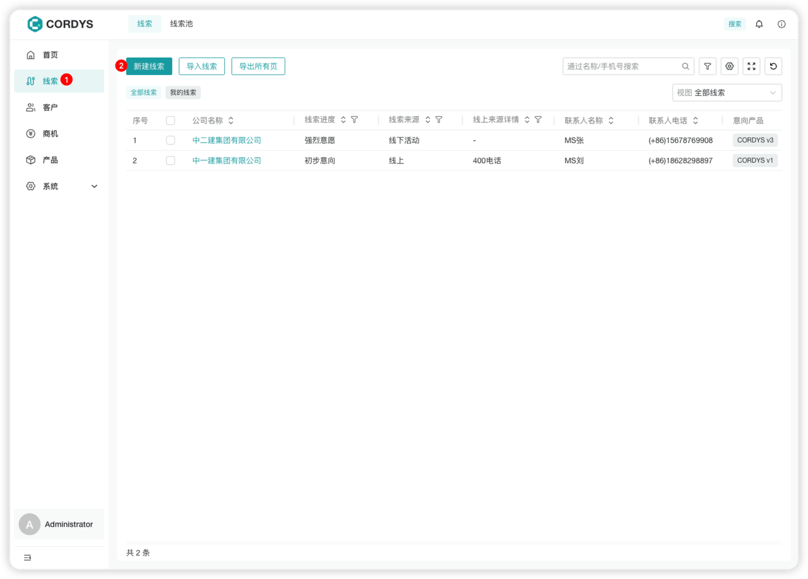

    用户可以「新建线索」或快捷「导入线索」。

    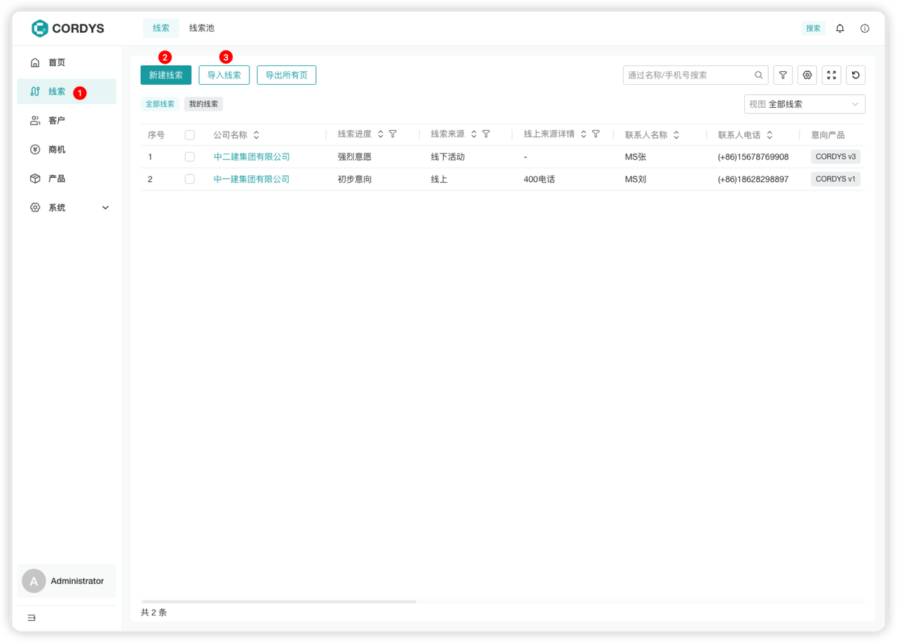

    **提示**：线索表单可以根据公司业务特性在表单设置中进行自定义。

    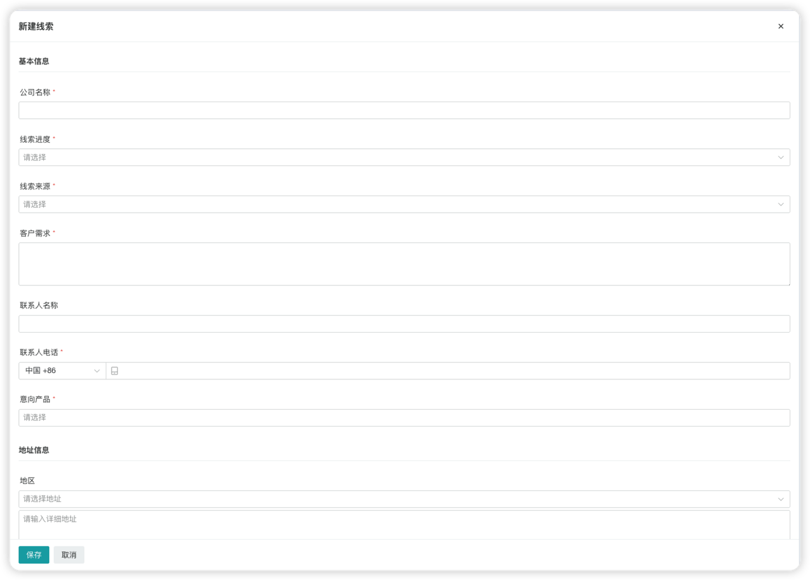

## 线索转换
!!! Abstract ""

    选择线索，点击「转换」，可以快捷将线索转换成客户/商机。

    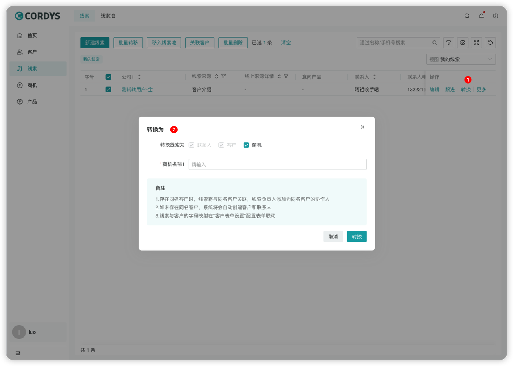

## 新建客户
!!! Abstract ""

    在左侧菜单点击【客户】，进入客户管理页面，用户可以：
     
     - 「新建客户」
     - 快捷「线索转为客户」

    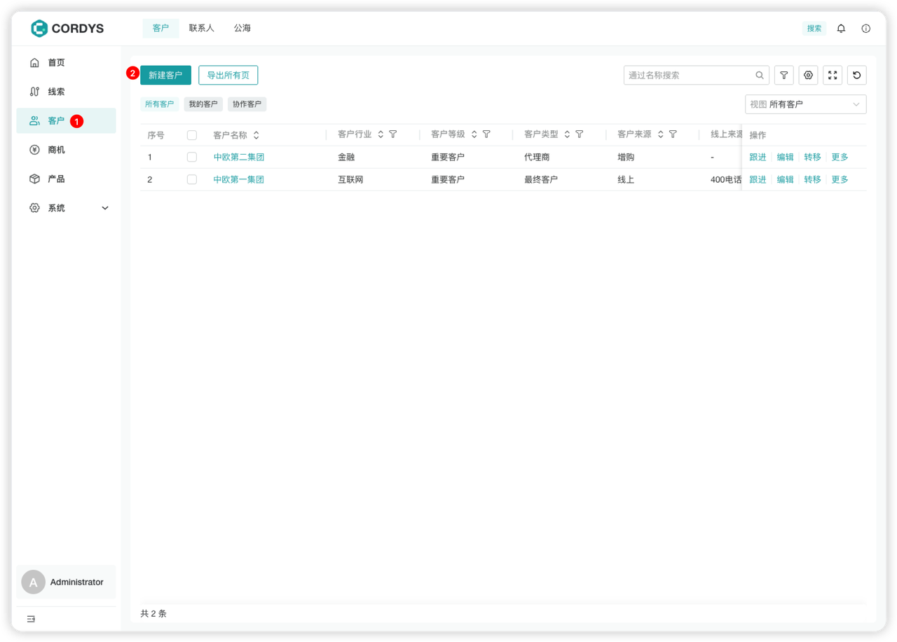

    **提示**：客户表单可以根据公司业务特性在表单设置中进行自定义。

    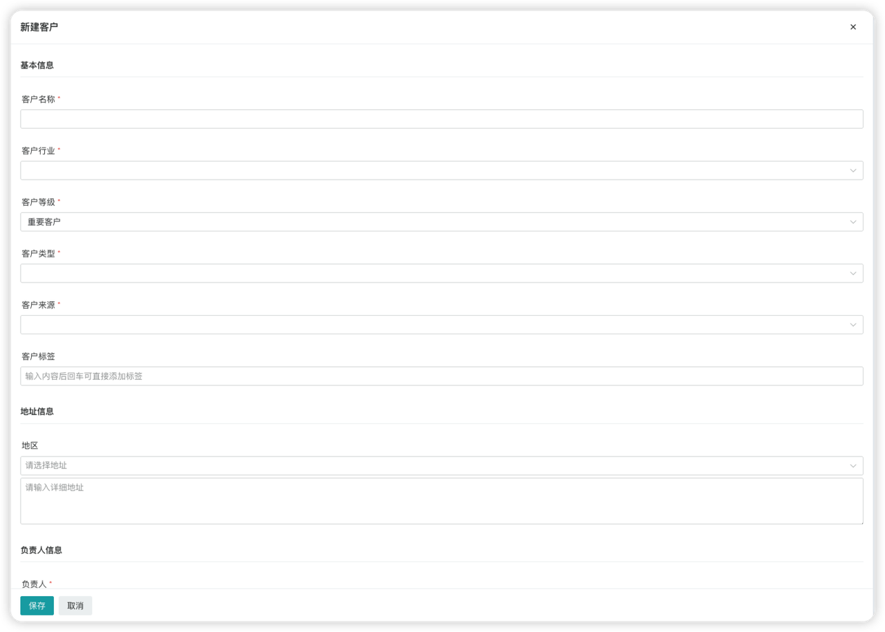

### 线索转为客户
!!! Abstract ""

    在线索详情中，点击「转换」，即可将线索一键转为客户。

    **注意**：转客户的线索不会展示在线索列表中。

    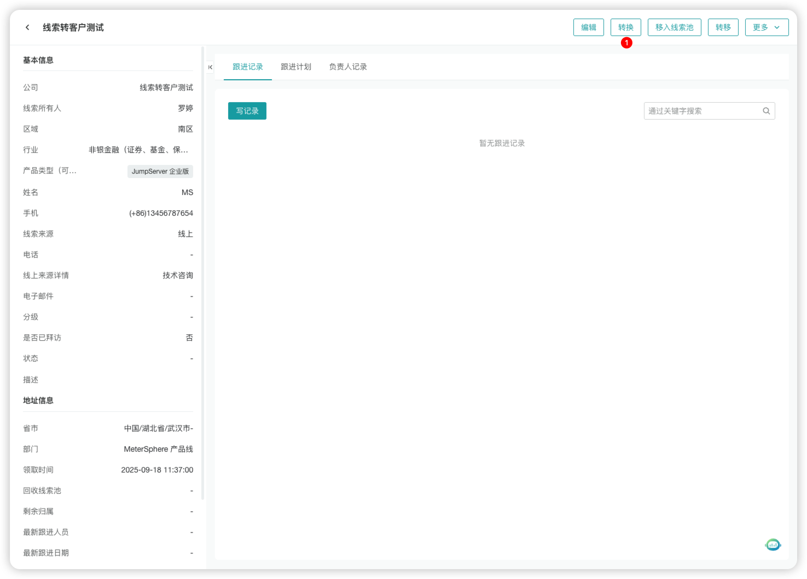

    线索转客户需管理员在“客户表单设置”中配置好表单联动，即可将线索信息快捷填充到客户表单。

    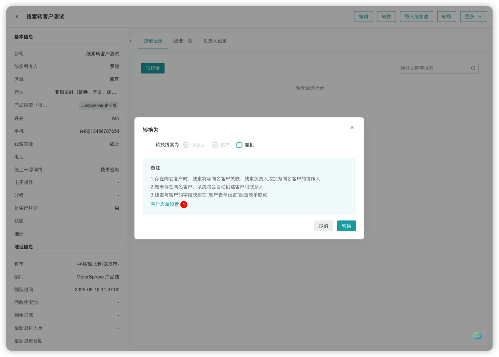

    管理员进入【系统-模块设置】，点击「客户表单设置」，进入「表单属性」，设置表单联动。

    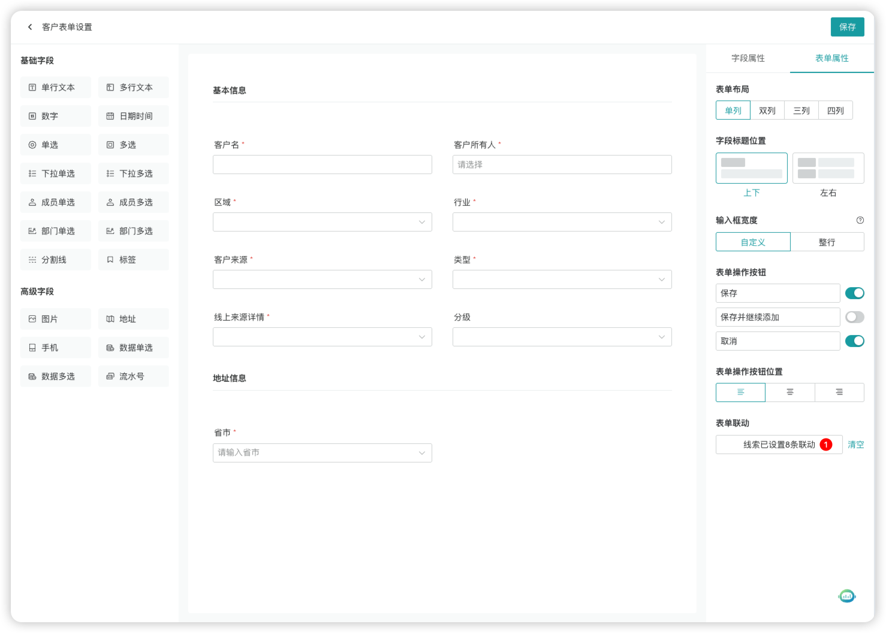

    配置好线索表单字段与客户表单字段的映射关系，在进行「线索转客户」操作时即可一键填充相应信息。

    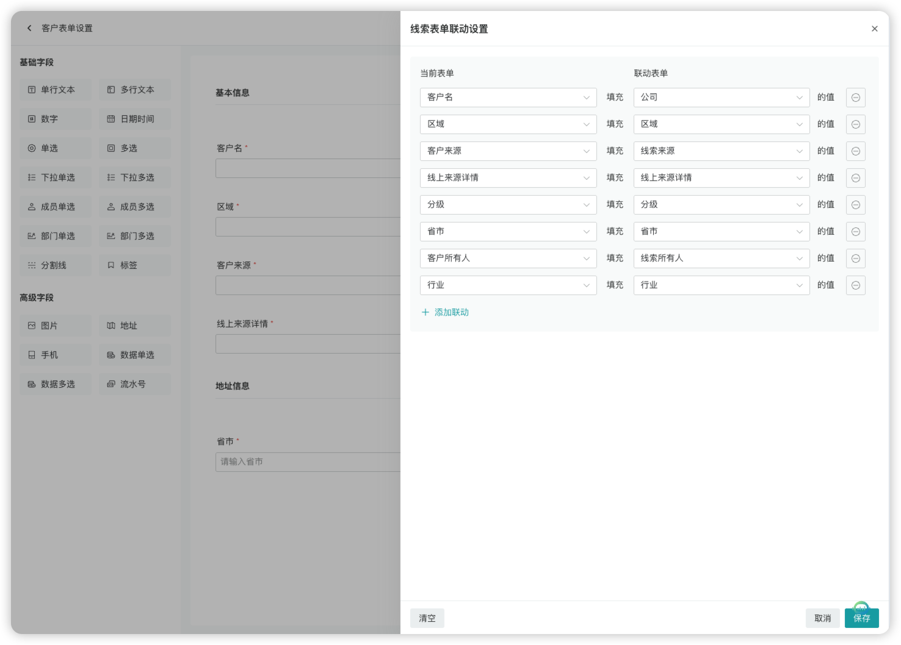

## 新建商机
!!! Abstract ""

    在左侧菜单点击【商机】，进入商机管理页面，用户可以：

     - 「新建商机」
     - 快捷「线索转为商机」

    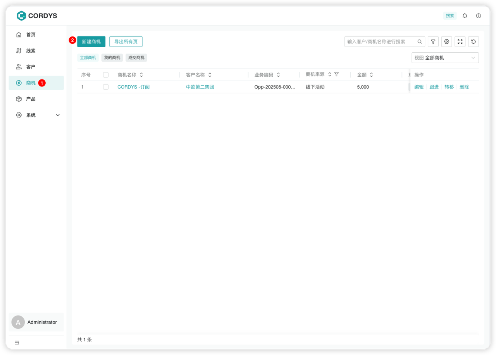
 

## 跟进商机
!!! Abstract ""

    点击商机名称或「跟进」按钮，进入商机详情页面。

### 功能说明

!!! Abstract ""

    用户可以根据跟进情况进行以下操作：

    - 修改商机阶段
    - 录入当前商机的「跟进记录」
    - 添加「跟进计划」

    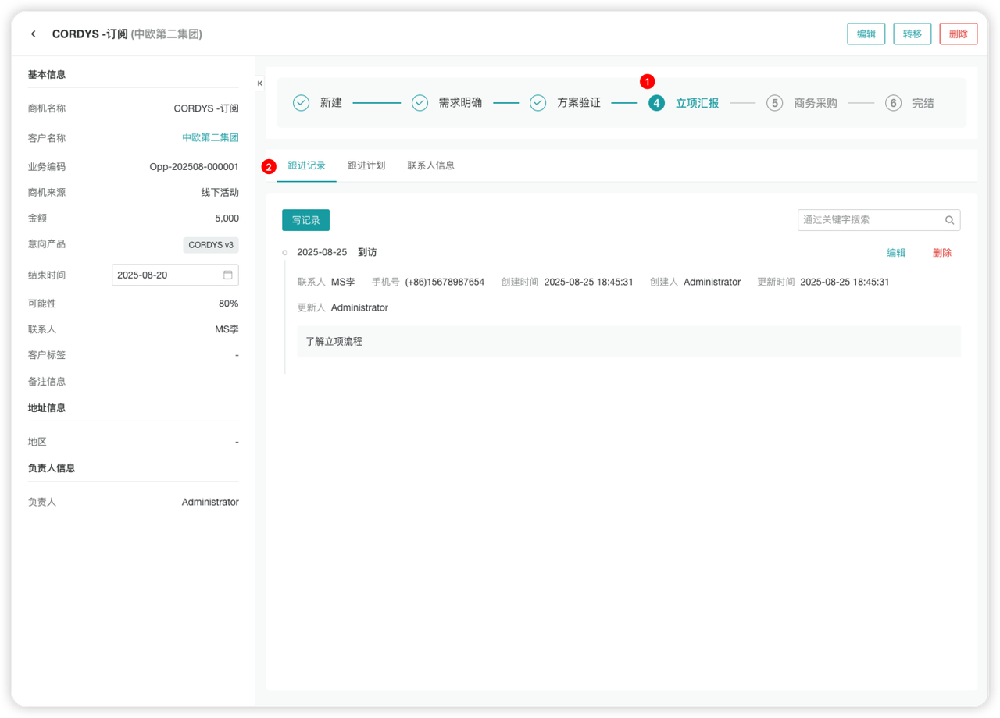