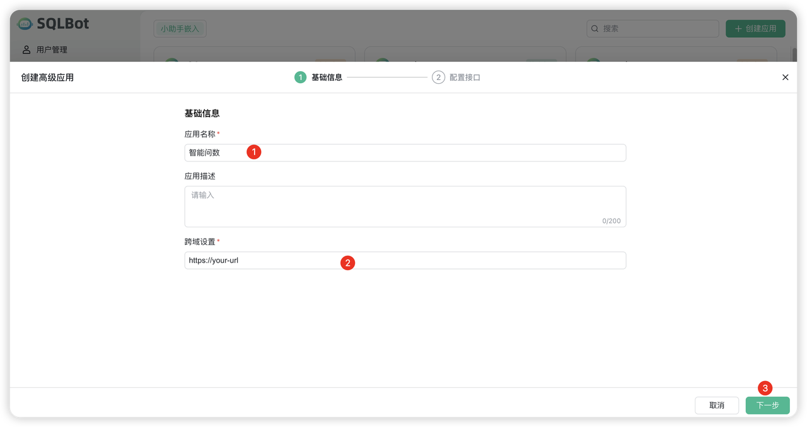
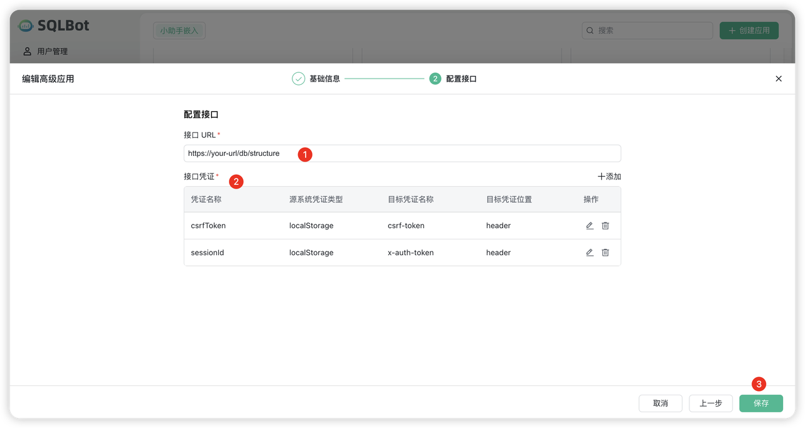
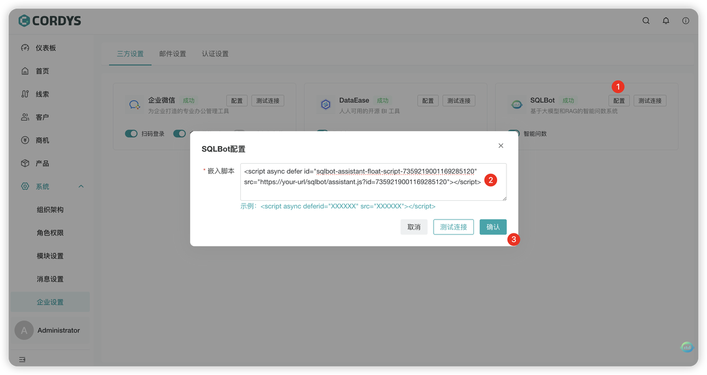
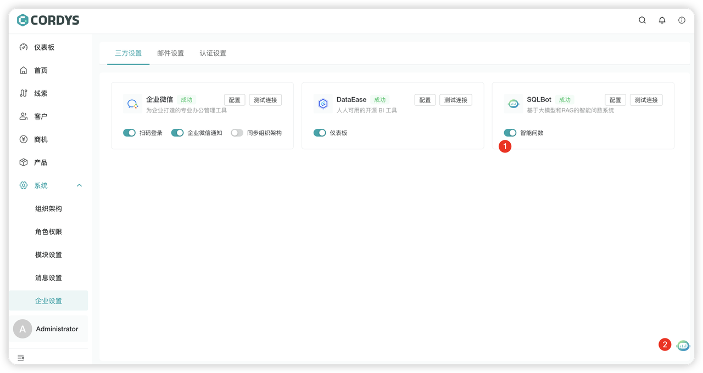

# 接入 SQLBot 实现智能问数

## 安装 SQLBot

!!! Abstract ""

    SQLBot 的安装教程请参考：[SQLBot 操作手册](https://dataease.cn/sqlbot/)

## 添加 SQLBot 应用

### 创建应用

!!! Abstract ""

    1. 登录 SQLBot
    2. 点击【系统管理】>【嵌入式管理】
    3. 点击「创建应用」并选择「高级应用」

    **注意**：跨域配置中应填写 Cordys CRM 的访问地址。为避免跨域异常，Cordys CRM 与 SQLBot 建议保持一致，即要么统一使用域名，要么统一使用 IP 地址。

    

### 配置接口

!!! Abstract ""

    - **接口地址**：填写 Cordys CRM 的部署地址，如 `http://CordysCRM-URL/db/structure` 

    - **凭证配置**：用于确保小助手能够访问 Cordys CRM 的 API，直接复制以下参数即可：
    
    | 凭证名称 | 源系统凭证类型 | 目标凭证名称 | 目标凭证位置 |
    |---------|---------------|-------------|:-----------:|
    | csrfToken | localStorage | csrf-token | header |
    | sessionId | localStorage | x-auth-token | header |

    

:warning: **注意:** 如果在问数过程中出现 401 错误，请检查上图这几个参数是否一致。

## 开放 Cordys CRM 的数据库端口

!!! Abstract ""

    为了确保 SQLBot 能够正常访问 Cordys CRM 的数据库，必须确保数据库端口对 SQLBot 可用。通过以下方式进行安装时，数据库端口并未暴露：

    - [1Panel 安装](../installation/1panel_installtion.md)
    - [在线安装](../installation/offline_installtion.md)
    - [Windows 安装](../installation/win.md)

    在集成 SQLBot 之前，请确认已开放数据库端口，以便 SQLBot 能够成功连接并执行查询操作。 

## Cordys CRM 中配置应用

!!! Abstract ""

    1. 登录 Cordys CRM 系统
    2. 进入【系统】>【企业设置】>【三方设置】
    3. 编辑 SQLBot 并粘贴上述脚本

    

### 验证配置

!!! Abstract ""

    配置完成后：

    1. 开启智能问数功能
    2. 在系统右下角查看 SQLBot 应用图标
    3. 图标显示即表示配置成功

    