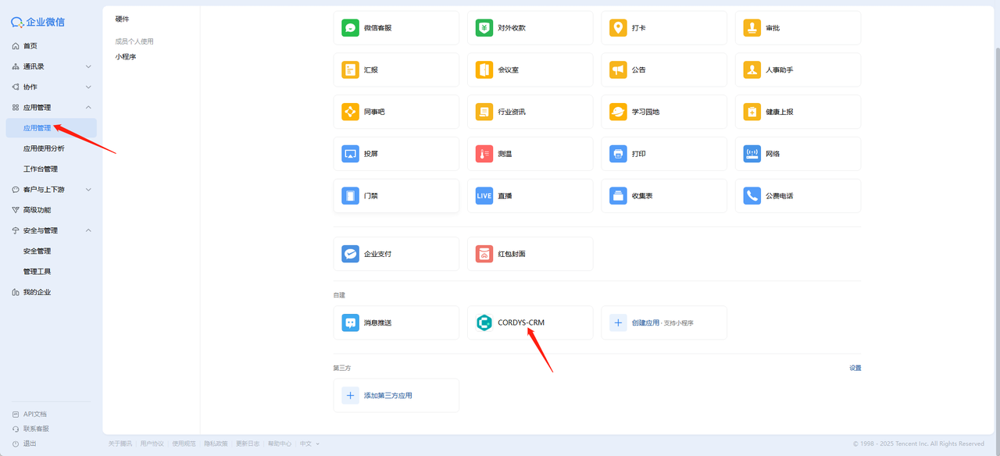

# 从企业微信同步

### 同步组织架构前的准备工作

#### 1. 企业微信管理员权限
需要使用"企业微信管理员账号"（或有通讯录管理权限的子管理员）。普通成员账号没有权限创建应用或同步通讯录。

#### 2. 创建应用并获取凭证
在企业微信管理后台创建自建应用或"第三方应用"，并获取以下关键凭证：
- 企业 ID（CorpID）
- 应用的 AgentId
- 应用的 Secret

这些参数用于获取 AccessToken 并调用接口。  
👉 官方文档：[获取 AccessToken](https://developer.work.weixin.qq.com/document/path/91039)

#### 3. 配置通讯录 API 权限
在企业微信后台为应用开启"通讯录读写权限"。常见需要的权限包括：
- 通讯录组织架构只读（同步组织结构）
- 通讯录组织架构读写（创建/修改部门和成员）

👉 官方文档：[接口权限](https://developer.work.weixin.qq.com/document/path/91039)

#### 4. 安全配置
- 配置应用的"可信 IP 白名单"，确保调用 API 时不被拒绝
- 如果需要接收企业微信推送的事件（如成员变更），需：
  - 部署 HTTPS 服务
  - 配置回调 URL

👉 官方文档：[回调模式](https://developer.work.weixin.qq.com/document/path/91770)

#### 5. 数据准备
确认外部系统中的部门、成员数据字段与企业微信字段对应：
- 部门 ID、父部门 ID、部门名称
- 成员账号（userid）、姓名、职位

> **注意**：手机号、邮箱等敏感字段默认不会在组织架构同步中返回，如需获取需额外授权。

---

### 配置企业微信参数

1. 点击【系统】菜单，进入【企业设置】页面
2. 在企业微信卡片，点击「配置」按钮，依次录入：
   - 企业 ID（从企业微信管理后台获取）
   - 应用 ID（企业微信中创建的应用专属 ID）
   - 应用秘钥（对应应用的安全秘钥）
3. 完成参数录入后，点击「测试连接」按钮验证配置有效性
4. 点击「确认」保存配置信息

---

### 开启同步组织架构开关

---

### 同步企业微信组织架构

1. 点击【系统】菜单，进入【组织架构】页面
2. 点击「更多」按钮下的「企业微信同步」选项，系统将自动触发同步流程
3. 同步完成后，页面左侧的组织架构区域将自动展示从企业微信同步过来的完整组织架构

**后续维护说明**：当企业微信中新增成员或调整组织架构后，只需重复执行上述「企业微信同步」操作，即可完成最新组织架构的更新。

#### 重要提醒

> **注意**：
> - 获取成员详情接口（user/get）从 2025 年 6 月 20 日 20:00 起，所有新创建的自建应用和代开发应用在调用 `user/get` 接口时，将不再返回头像、性别、手机号、邮箱、企业邮箱、地址等敏感字段。只有通过 OAuth2 授权流程，并获得管理员以及成员本人授权后，才能获取完整信息。  
>   👉 官方文档：[user/get](https://developer.work.weixin.qq.com/document/path/91039)
> - 同步通讯录接口仅返回组织架构和成员基础信息，不会包含手机号、邮箱等敏感字段。  
>   👉 官方文档：[通讯录同步](https://developer.work.weixin.qq.com/document/path/91039)

---

### OAuth2 授权流程

1. 系统 → 企业设置 → 认证设置 → 添加 OAuth2 认证
2. 企业微信中 OAuth 2.0 授权 URL 示例（`appid` 和 `agentid` 替换为实际值）

