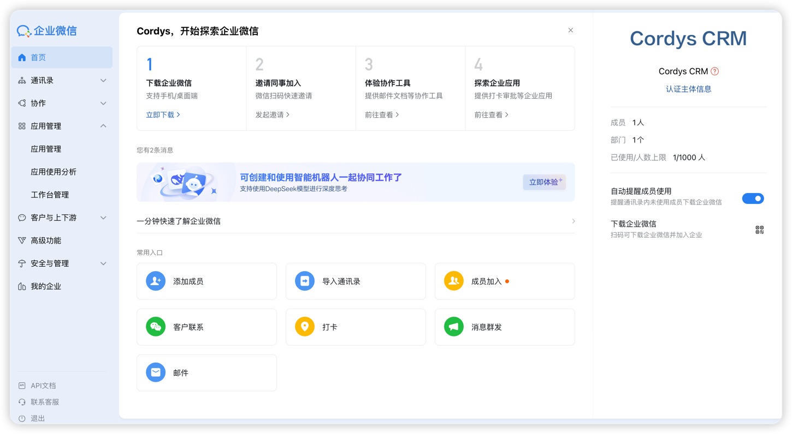
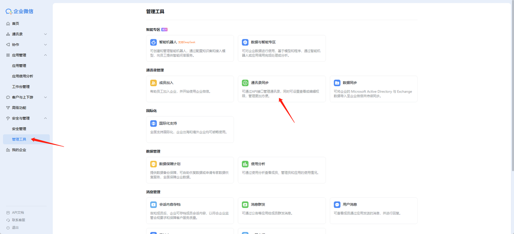
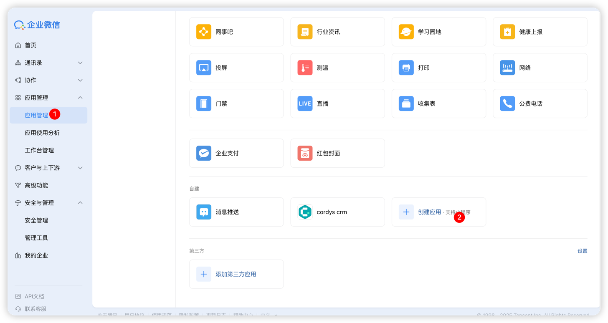
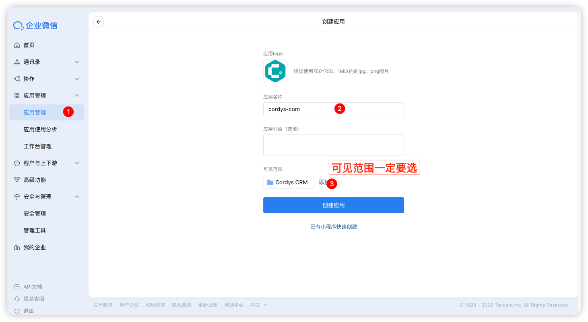
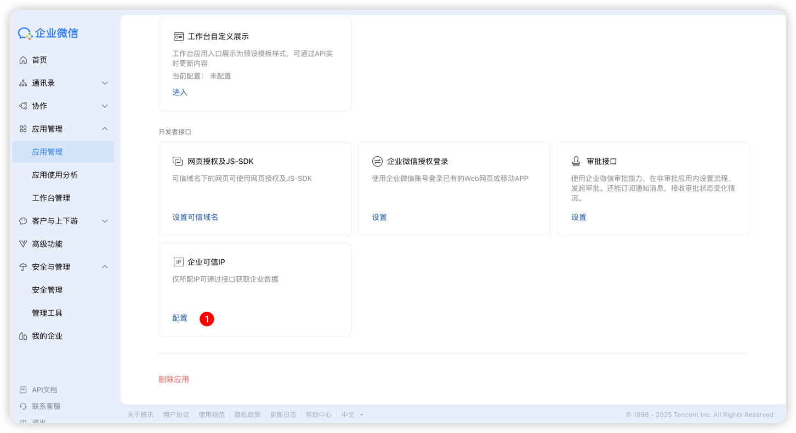
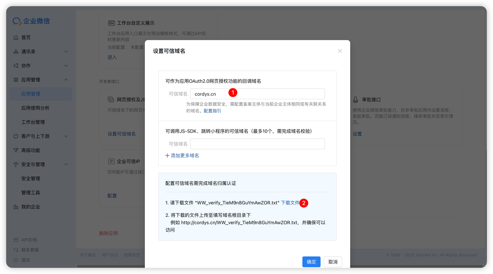
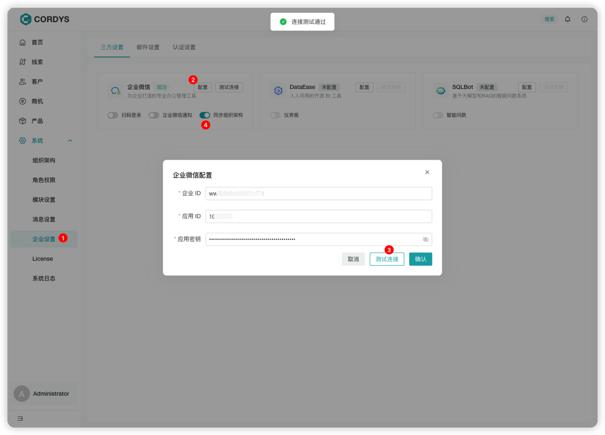
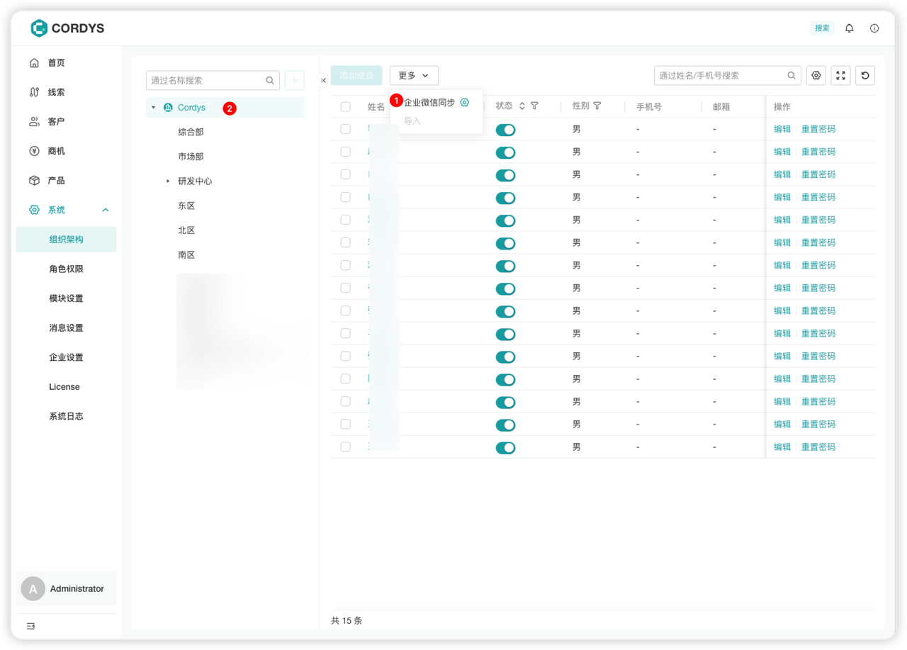
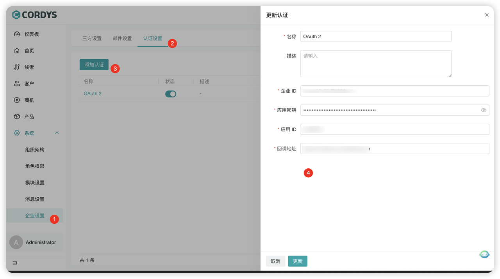
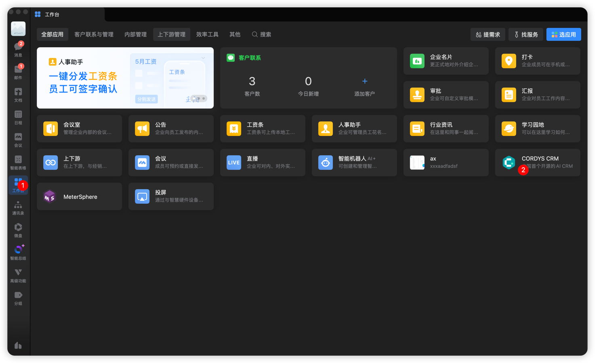

# 企业微信对接

## 企业微信配置

!!! Abstract ""

    #### 1. 企业微信管理员权限

    需要使用“企业微信管理员账号”（或具有通讯录管理权限的子管理员），普通成员账号没有权限创建应用或同步通讯录。

    #### 2. 登录 [企业微信管理后台](https://work.weixin.qq.com/wework_admin/loginpage_wx?from=myhome) 

    

    #### 3. 配置通讯录 API 权限

      在企业微信后台为应用开启"通讯录读写权限"。常见需要的权限包括：

      - 通讯录组织架构只读（同步组织结构）
      - 通讯录组织架构读写（创建/修改部门和成员）

      

    #### 4. 创建应用并获取凭证

    在企业微信管理后台创建自建应用或"第三方应用"，并获取以下关键凭证：

     - 企业 ID（CorpID）
     - 应用的 AgentId
     - 应用的 Secret

      
      

    #### 5. 安全配置

      - 配置应用的"可信 IP 白名单"，确保调用 API 时不被拒绝
      - 部署 HTTPS 服务
      - 配置回调 URL

      

        配置可信域名需完成域名归属认证：

         把下载的文件放在 域名的根目录下，访问 `https://yourdomain/WW_verify_TieM9n8GuYmAwZOR.txt”` 验证成功后，企业微信会自动检测到。
         通常根目录是 /var/www/html/ 或 /usr/share/nginx/html/ 或 /var/www/ 等，具体根据服务器配置而定。
         
      

    #### 5. 数据准备

      确认外部系统中的部门、成员数据字段与企业微信字段对应：

      - 部门 ID、父部门 ID、部门名称
      - 成员账号（userid）、姓名、职位

      :warning: **注意**：

    - 手机号、邮箱等敏感字段默认不会在组织架构同步中返回，如需获取需额外授权；
    - 如果要使用 【组织架构同步】和【OAuth2 认证】功能 Cordys CRM 部署地址必须是可信域名，不能使用 IP 地址或自己做的内网穿透地址。

## Cordys CRM 配置同步组织架构

### 配置企业微信信息

!!! Abstract ""

    

### 同步企业微信组织架构

!!! Abstract ""

    1. 点击【系统】菜单，进入【组织架构】页面
    2. 点击「更多」按钮下的「企业微信同步」选项，系统将自动触发同步流程
    3. 同步完成后，页面左侧的组织架构区域将自动展示从企业微信同步过来的完整组织架构

    **后续维护说明**：当企业微信中新增成员或调整组织架构后，只需重复执行上述「企业微信同步」操作，即可完成最新组织架构的更新。

    

    #### 重要提醒：

       - 获取成员详情接口（user/get）从 2025 年 6 月 20 日 20:00 起，所有新创建的自建应用和代开发应用在调用 `user/get` 接口时，将不再返回头像、性别、手机号、邮箱、企业邮箱、地址等敏感字段。只有通过 OAuth2 授权流程，并获得管理员以及成员本人授权后，才能获取完整信息。  

       - 同步通讯录接口仅返回组织架构和成员基础信息，不会包含手机号、邮箱等敏感字段。  
         
      👉 官方文档：[通讯录同步](https://developer.work.weixin.qq.com/document/path/91039)

## OAuth2 授权流程

!!! Abstract ""

    1. 系统 → 企业设置 → 认证设置 → 添加 OAuth2 认证
    2. 企业微信中 OAuth 2.0 授权 URL 示例（`appid` 和 `agentid` 替换为实际值）

    

## 企业微信工作台访问 Cordys CRM

!!! Abstract ""

    
    
